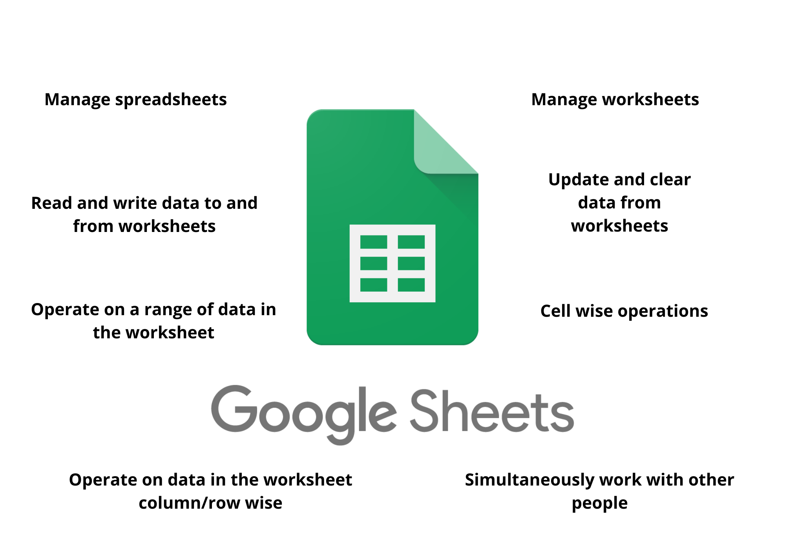
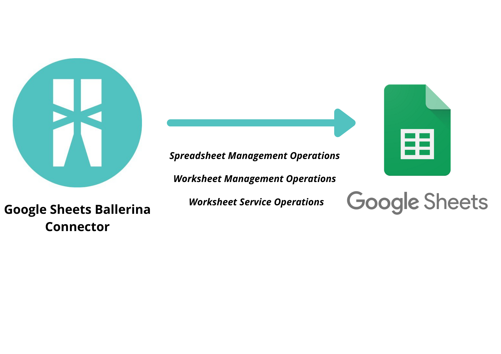

# Ballerina Google Sheets Connector

[](https://travis-ci.org/ballerina-ballerinax-platform/module-ballerinax-googleapis.sheets)
[](https://github.com/ballerina-platform/module-ballerinax-googleapis.sheets/actions?query=workflow%3ACI)
[](https://github.com/ballerina-platform/module-ballerinax-googleapis.sheets/commits/master)
[](https://opensource.org/licenses/Apache-2.0)

Connects to Google Sheets using Ballerina.

# Introduction

## What is Google Sheets?

[Google Sheets](https://developers.google.com/sheets/api) is an online spreadsheet that lets users create and format spreadsheets and simultaneously work with other people. It lets us manage spreadsheets, manage worksheets, read, write, update and clear data from worksheets and do column wise, row wise and cell wise operations. The Google Spreadsheet endpoint allows you to access the Google Spreadsheet API Version v4 through Ballerina.

## Key Features of Google Sheets

Read, write, and format data in Sheets. The latest version of the Sheets API lets developers programmatically:

* Manage spreadsheets
* Manage worksheets
* Read and write data to and from worksheets
* Update and clear data from worksheets
* Operate on a range of data in the worksheet
* Operate on data in the worksheet column wise
* Operate on data in the worksheet row wise
* Cell wise operations
* Simultaneously work with other people



## Connector Overview

The Google Spreadsheet Ballerina Connector allows you to access the [Google Spreadsheet API Version v4](https://developers.google.com/sheets/api) through Ballerina. The connector can be used to implement some of the most common use cases of Google Spreadsheets. The connector provides the capability to programmatically manage spreadsheets, manage worksheets, do CRUD operations on worksheets, and do column wise, row wise and cell wise operations through the connector endpoints.

The Google Spreadsheet Ballerina Connector supports spreadsheet management operations like creating a spreadsheet, opening a spreadsheet, listing all the spreadsheets available in a user account, renaming a spreadsheet. It also supports worksheet management operations like getting all the worksheets available in a spreadsheet, opening a worksheet, adding a new worksheet, removing a worksheet and renaming a worksheet. The connector also provides capabilities to handle data level operations like setting, getting and clearing a range of data, inserting columns/rows before and after a given position, creating or updating, getting and deleting columns/rows, setting, getting and clearing cell data, appending a row to a sheet, appending a row to a range of data, appending a cell to a range of data, copying a worksheet to a destination spreadsheet, and clearing worksheets.



# Prerequisites

* Java 11 Installed
Java Development Kit (JDK) with version 11 is required.

* Download the Ballerina [distribution](https://ballerinalang.org/downloads/) SLP8
Ballerina Swan Lake Preview Version 8 is required.

* Instantiate the connector by giving authentication details in the HTTP client config. The HTTP client config has built-in support for BasicAuth and OAuth 2.0. Google Spreadsheet uses OAuth 2.0 to authenticate and authorize requests. The Google Spreadsheet connector can be minimally instantiated in the HTTP client config using the access token or the client ID, client secret, and refresh token.
    * Access Token
    * Client ID
    * Client Secret
    * Refresh Token
    * Refresh URL

## Obtaining Tokens

1. Visit [Google API Console](https://console.developers.google.com), click **Create Project**, and follow the wizard to create a new project.
2. Go to **Credentials -> OAuth consent screen**, enter a product name to be shown to users, and click **Save**.
3. On the **Credentials** tab, click **Create credentials** and select **OAuth client ID**. 
4. Select an application type, enter a name for the application, and specify a redirect URI (enter https://developers.google.com/oauthplayground if you want to use 
[OAuth 2.0 playground](https://developers.google.com/oauthplayground) to receive the authorization code and obtain the 
access token and refresh token). 
5. Click **Create**. Your client ID and client secret appear. 
6. In a separate browser window or tab, visit [OAuth 2.0 playground](https://developers.google.com/oauthplayground), select the required Google Spreadsheet scopes, and then click **Authorize APIs**.
7. When you receive your authorization code, click **Exchange authorization code for tokens** to obtain the refresh token and access token.

## Add project configurations file
Add the project configuration file by creating a `ballerina.conf` file under the root path of the project structure.
This file should have following configurations. Add the tokens obtained in the previous step to the `ballerina.conf` file.

```
ACCESS_TOKEN = "<access_token>"
CLIENT_ID = "<client_id">
CLIENT_SECRET = "<client_secret>"
REFRESH_TOKEN = "<refresh_token>"
REFRESH_URL = "<refresh_URL>"
```

# Supported Versions & Limitations

## Supported Versions

|                                   | Version               |
|:---------------------------------:|:---------------------:|
| Google Sheets API Version         | V4                    |
| Ballerina Language                | Swan-Lake-Preview8    |
| Java Development Kit (JDK)        | 11                    |

## Limitations

The connector doesn't support some of the capabilities offered by Google Sheet API V4.

# Quickstart(s)

## Working with GSheets Endpoint Actions

You must follow the following steps in order to obtain the tokens needed for the configuration of the Ballerina Connector.

1. Visit [Google API Console](https://console.developers.google.com), click **Create Project**, and follow the wizard to create a new project.
2. Go to **Credentials -> OAuth consent screen**, enter a product name to be shown to users, and click **Save**.
3. On the **Credentials** tab, click **Create credentials** and select **OAuth client ID**. 
4. Select an application type, enter a name for the application, and specify a redirect URI (enter https://developers.google.com/oauthplayground if you want to use 
[OAuth 2.0 playground](https://developers.google.com/oauthplayground) to receive the authorization code and obtain the 
access token and refresh token). 
5. Click **Create**. Your client ID and client secret appear. 
6. In a separate browser window or tab, visit [OAuth 2.0 playground](https://developers.google.com/oauthplayground), select the required Google Spreadsheet scopes, and then click **Authorize APIs**.
7. When you receive your authorization code, click **Exchange authorization code for tokens** to obtain the refresh token and access token.

### Step 1: Import the Google Sheets Ballerina Library
First, import the ballerinax/googleapis_sheets module into the Ballerina project.
```ballerina
    import ballerinax/googleapis_sheets as sheets;
```
All the actions return valid response or error. If the action is a success, then the requested resource will be returned. Else error will be returned.

### Step 2: Initialize the Google Sheets Client
In order for you to use the GSheets Endpoint, first you need to create a GSheets Client endpoint.
```ballerina
sheets:SpreadsheetConfiguration config = {
    oauth2Config: {
        accessToken: "<Access token here>",       
        refreshConfig: {
                clientId: "<CLIENT_ID>",
                clientSecret: "<CLIENT_SECRET>",
                refreshUrl: "<REFRESH_URL>",
                refreshToken: "<REFRESH_TOKEN>"
            }
        }
};
 
sheets:Client spreadsheetClient = new (config);
```
Then the endpoint actions can be invoked as `var response = spreadsheetClient->actionName(arguments)`.

### Step 3: Sample with default truststore
```ballerina
import ballerina/io;
import ballerinax/googleapis_sheets as sheets;

sheets:SpreadsheetConfiguration spreadsheetConfig = {
    oauth2Config: {
        accessToken: "<accessToken>",
        refreshConfig: {
            clientId: "<clientId>",
            clientSecret: "<clientSecret>",
            refreshUrl: "<refreshUrl>",
            refreshToken: "<refreshToken>"
        }
    }
};

sheets:Client spreadsheetClient = new (spreadsheetConfig);

public function main(string... args) {
    var response = spreadsheetClient->openSpreadsheetById(<spreadsheet-id>);
    if (response is sheets:Spreadsheet) {
        io:println("Spreadsheet Details: ", response);
    } else {
        io:println("Error: ", response);
    }
}
```

### Step 4: Sample with custom truststore
```ballerina
import ballerina/io;
import ballerinax/googleapis_sheets as sheets;

sheets:SpreadsheetConfiguration spreadsheetConfig = {
    oauth2Config: {
        accessToken: "<accessToken>",
        refreshConfig: {
            clientId: "<clientId>",
            clientSecret: "<clientSecret>",
            refreshUrl: "<refreshUrl>",
            refreshToken: "<refreshToken>"
        }
    },
    secureSocketConfig: {
        trustStore: {
            path: "<fullQualifiedPathToTrustStore>",
            password: "<truststorePassword>"
        }
    }
};

sheets:Client spreadsheetClient = new (spreadsheetConfig);

public function main(string... args) {
    var response = spreadsheetClient->openSpreadsheetById(<spreadsheet-id>);
    if (response is sheets:Spreadsheet) {
        io:println("Spreadsheet Details: ", response);
    } else {
        io:println("Error: ", response);
    }
}
```

## Get, Set and Clear Range in a Worksheet 

This is the simplest scenario to use the Google Spreadsheet ballerina connector to handle data level operations at a given range. We can set, get and clear the values of the given range of cells of the Worksheet with given Name from the Spreadsheet with the given Spreadsheet ID. You must follow the following steps in order to obtain the tokens needed for the configuration of the Ballerina Connector.

1. Visit [Google API Console](https://console.developers.google.com), click **Create Project**, and follow the wizard to create a new project.
2. Go to **Credentials -> OAuth consent screen**, enter a product name to be shown to users, and click **Save**.
3. On the **Credentials** tab, click **Create credentials** and select **OAuth client ID**. 
4. Select an application type, enter a name for the application, and specify a redirect URI (enter https://developers.google.com/oauthplayground if you want to use 
[OAuth 2.0 playground](https://developers.google.com/oauthplayground) to receive the authorization code and obtain the 
access token and refresh token). 
5. Click **Create**. Your client ID and client secret appear. 
6. In a separate browser window or tab, visit [OAuth 2.0 playground](https://developers.google.com/oauthplayground), select the required Google Spreadsheet scopes, and then click **Authorize APIs**.
7. When you receive your authorization code, click **Exchange authorization code for tokens** to obtain the refresh token and access token.

### Step 1: Import the Google Sheets Ballerina Library
```ballerina
    import ballerinax/googleapis_sheets as sheets;
```
All the actions return valid response or error. If the action is a success, then the requested resource will be returned. Else error will be returned.

### Step 2: Initialize the Google Sheets Client
In order for you to use the GSheets Endpoint, first you need to create a GSheets Client endpoint.
In order for you to use the GSheets Endpoint, first you need to create a GSheets Client endpoint.
```ballerina
sheets:SpreadsheetConfiguration config = {
    oauth2Config: {
        accessToken: "<Access token here>",       
        refreshConfig: {
                clientId: "<CLIENT_ID>",
                clientSecret: "<CLIENT_SECRET>",
                refreshUrl: "<REFRESH_URL>",
                refreshToken: "<REFRESH_TOKEN>"
            }
        }
};
 
sheets:Client spreadsheetClient = new (config);
```

### Step 3: Create Spreadsheet with given name
We must specify the spreadsheet name as a string parameter to the createSpreadsheet remote operation. This is the basic scenario of creating a new spreadsheet with the name “NewSpreadsheet”. It returns a Spreadsheet record type with all the information related to the spreadsheet created on success and a ballerina error if the operation is unsuccessful.
```ballerina
    string spreadsheetId = "";
    string sheetName = "";
    
    // Create Spreadsheet with given name
    sheets:Spreadsheet|error response = spreadsheetClient->createSpreadsheet("NewSpreadsheet");
    if (response is sheets:Spreadsheet) {
        log:print("Spreadsheet Details: " + response.toString());
        spreadsheetId = response.spreadsheetId;
    } else {
        log:printError("Error: " + response.toString());
    }
```

### Step 4: Add a New Worksheet with given name
We must specify the spreadsheet ID and the name for the new worksheet as string parameters to the addSheet remote operation. Spreadsheet ID is available in the spreadsheet URL "https://docs.google.com/spreadsheets/d/" + <spreadsheetId> + "/edit#gid=" + <sheetId>. This is the basic scenario of adding a new worksheet  with the name “NewWorksheet” by the spreadsheet ID which is obtained when creating a new spreadsheet. It returns a Sheet record type with all the information related to the worksheet added on success and a ballerina error if the operation is unsuccessful.
```ballerina
    // Add a New Worksheet with given name to the Spreadsheet with the given Spreadsheet ID
    sheets:Sheet|error sheet = spreadsheetClient->addSheet(spreadsheetId, "NewWorksheet");
    if (sheet is sheets:Sheet) {
        log:print("Sheet Details: " + sheet.toString());
        sheetName = sheet.properties.title;
    } else {
        log:printError("Error: " + sheet.toString());
    }
```

### Step 5: Specify the Range of the values to be entered
We must specify the range as a Range Record type that includes the range as a string representing A1 notation and values to be entered in the range. Here the input array is written row wise to the worksheet.
```ballerina
    string a1Notation = "A1:D5";
    string[][] entries = [
        ["Name", "Score", "Performance", "Average"],
        ["Keetz", "12"],
        ["Niro", "78"],
        ["Nisha", "98"],
        ["Kana", "86"]
    ];
    sheets:Range range = {a1Notation: a1Notation, values: entries};
```

### Step 6: Set Range of Values
We must specify the spreadsheet ID as a string parameter, the name of the required worksheet as a string parameter and the range specified as a Range Record type that includes the A1 notation and values in the range, to the setRange remote operation. Spreadsheet ID and Worksheet ID is available in the spreadsheet URL "https://docs.google.com/spreadsheets/d/" + <spreadsheetId> + "/edit#gid=" + <sheetId>. This is the basic scenario of setting the values of the given range of cells of a worksheet with the name obtained when creating a new worksheet and by the spreadsheet ID which is obtained when creating a new spreadsheet. It returns Nil on success and a ballerina error if the operation is unsuccessful.
```ballerina
    // Sets the values of the given range of cells of the Sheet
    error? spreadsheetRes = spreadsheetClient->setRange(spreadsheetId, sheetName, range);
```

### Step 7: Get Range of Values
We must specify the spreadsheet ID as a string parameter, the name of the required worksheet as a string parameter and the range specified in A1 notation, to the getRange remote operation. Spreadsheet ID and Worksheet ID is available in the spreadsheet URL "https://docs.google.com/spreadsheets/d/" + <spreadsheetId> + "/edit#gid=" + <sheetId>. This is the basic scenario of getting the values of the given range of cells of a worksheet with the name obtained when creating a new worksheet and by the spreadsheet ID which is obtained when creating a new spreadsheet. It returns a Range Record type that includes the A1 notation and values in the range, on success and a ballerina error if the operation is unsuccessful.
```ballerina
    // Sets the values of the given range of cells of the Sheet
    error? spreadsheetRes = spreadsheetClient->setRange(spreadsheetId, sheetName, range);
    if (spreadsheetRes is ()) {
        // Gets the given range of the Sheet
        sheets:Range|error getValuesResult = spreadsheetClient->getRange(spreadsheetId, sheetName, a1Notation);
        if (getValuesResult is sheets:Range) {
            log:print("Range Details: " + getValuesResult.values.toString());
        } else {
            log:printError("Error: " + getValuesResult.toString());
        }
    } else {
        log:printError("Error: " + spreadsheetRes.toString());
    }
```

### Step 8: Clear Range of Values
We must specify the spreadsheet ID as a string parameter, the name of the required worksheet as a string parameter and the range specified in A1 notation, to the clearRange remote operation. Spreadsheet ID and Worksheet ID is available in the spreadsheet URL "https://docs.google.com/spreadsheets/d/" + <spreadsheetId> + "/edit#gid=" + <sheetId>. This is the basic scenario of clearing the values of the given range of cells of a worksheet with the name obtained when creating a new worksheet and by the spreadsheet ID which is obtained when creating a new spreadsheet. It returns Nil on success and a ballerina error if the operation is unsuccessful.
```ballerina
    // Sets the values of the given range of cells of the Sheet
    error? spreadsheetRes = spreadsheetClient->setRange(spreadsheetId, sheetName, range);
    if (spreadsheetRes is ()) {
        // Clears the range of contents, formats, and data validation rules
        error? clear = spreadsheetClient->clearRange(spreadsheetId, sheetName, a1Notation);
        if (clear is ()) {            
            sheets:Range|error openRes = spreadsheetClient->getRange(spreadsheetId, sheetName, a1Notation);
            if (openRes is sheets:Range) {
                log:print("Range Details: " + openRes.values.toString());
            } else {
                log:printError("Error: " + openRes.toString());
            }
        } else {
            log:printError("Error: " + clear.toString());
        }
    } else {
        log:printError("Error: " + spreadsheetRes.toString());
    }
```

Sample is available at: 
https://github.com/ballerina-platform/module-ballerinax-googleapis.sheets/blob/master/samples/appendRowToRange.bal

# Samples

## Spreadsheet Management Operations
The Google Spreadsheet Ballerina Connector allows you to access the Google Spreadsheet API Version v4 through Ballerina to handle spreadsheet management operations like creating a spreadsheet, opening a spreadsheet, listing all the spreadsheets available in a user account, renaming a spreadsheet.

### Create Spreadsheet
This section shows how to use the Google Spreadsheet ballerina connector to create a new spreadsheet. We must specify the spreadsheet name as a string parameter to the createSpreadsheet remote operation. This is the basic scenario of creating a new spreadsheet with the name “NewSpreadsheet”. It returns a Spreadsheet record type with all the information related to the spreadsheet created on success and a ballerina error if the operation is unsuccessful.

Sample is available at:
https://github.com/ballerina-platform/module-ballerinax-googleapis.sheets/blob/master/samples/createSpreadsheet.bal

```ballerina
import ballerinax/googleapis_sheets as sheets;
import ballerina/config;
import ballerina/log;

sheets:SpreadsheetConfiguration config = {
    oauth2Config: {
        accessToken: "<Access token here>",
        refreshConfig: {
            clientId: config:getAsString("CLIENT_ID"),
            clientSecret: config:getAsString("CLIENT_SECRET"),
            refreshUrl: config:getAsString("REFRESH_URL"),
            refreshToken: config:getAsString("REFRESH_TOKEN")
        }
    }
};

sheets:Client spreadsheetClient = new (config);

public function main() {
    // Create Spreadsheet with given name
    sheets:Spreadsheet|error response = spreadsheetClient->createSpreadsheet("NewSpreadsheet");
    if (response is sheets:Spreadsheet) {
        log:print("Spreadsheet Details: " + response.toString());
    } else {
        log:printError("Error: " + response.toString());
    }
}
```

### Open Spreadsheet by Spreadsheet ID
This section shows how to use the Google Spreadsheet ballerina connector to open a spreadsheet by spreadsheet ID. We must specify the spreadsheet ID as a string parameter to the openSpreadsheetById remote operation. Spreadsheet ID is available in the spreadsheet URL "https://docs.google.com/spreadsheets/d/" + <spreadsheetId> + "/edit#gid=0". This is the basic scenario of opening a spreadsheet with the spreadsheet ID obtained when creating a new spreadsheet. It returns a Spreadsheet record type with all the information related to the spreadsheet opened on success and a ballerina error if the operation is unsuccessful.

Sample is available at:
https://github.com/ballerina-platform/module-ballerinax-googleapis.sheets/blob/master/samples/openSpreadsheetById.bal

```ballerina
import ballerinax/googleapis_sheets as sheets;
import ballerina/config;
import ballerina/log;

sheets:SpreadsheetConfiguration config = {
    oauth2Config: {
        accessToken: "<Access token here>",
        refreshConfig: {
            clientId: config:getAsString("CLIENT_ID"),
            clientSecret: config:getAsString("CLIENT_SECRET"),
            refreshUrl: config:getAsString("REFRESH_URL"),
            refreshToken: config:getAsString("REFRESH_TOKEN")
        }
    }
};

sheets:Client spreadsheetClient = new (config);

public function main() {
    string spreadsheetId = "";

    // Create Spreadsheet with given name
    sheets:Spreadsheet|error response = spreadsheetClient->createSpreadsheet("NewSpreadsheet");
    if (response is sheets:Spreadsheet) {
        log:print("Spreadsheet Details: " + response.toString());
        spreadsheetId = response.spreadsheetId;
    } else {
        log:printError("Error: " + response.toString());
    }

    // Open Spreadsheet with Spreadsheet ID
    // Spreadsheet ID in the URL "https://docs.google.com/spreadsheets/d/" + <spreadsheetId> + "/edit#gid=0"
    sheets:Spreadsheet|error spreadsheet = spreadsheetClient->openSpreadsheetById(spreadsheetId);
    if (spreadsheet is sheets:Spreadsheet) {
        log:print("Spreadsheet Details: " + spreadsheet.toString());
    } else {
        log:printError("Error: " + spreadsheet.toString());
    }
}
```

### Open Spreadsheet by Spreadsheet URL
This section shows how to use the Google Spreadsheet ballerina connector to open a spreadsheet by spreadsheet URL. We must specify the spreadsheet ID as a string parameter to the openSpreadsheetByUrl remote operation. Spreadsheet URL is in the following format "https://docs.google.com/spreadsheets/d/" + <spreadsheetId> + "/edit#gid=" + <sheetId>. This is the basic scenario of opening a spreadsheet with the spreadsheet URL obtained when creating a new spreadsheet. It returns a Spreadsheet record type with all the information related to the spreadsheet opened on success and a ballerina error if the operation is unsuccessful.

Sample is available at:
https://github.com/ballerina-platform/module-ballerinax-googleapis.sheets/blob/master/samples/openSpreadsheetByUrl.bal

```ballerina
import ballerinax/googleapis_sheets as sheets;
import ballerina/config;
import ballerina/log;

sheets:SpreadsheetConfiguration config = {
    oauth2Config: {
        accessToken: "<Access token here>",
        refreshConfig: {
            clientId: config:getAsString("CLIENT_ID"),
            clientSecret: config:getAsString("CLIENT_SECRET"),
            refreshUrl: config:getAsString("REFRESH_URL"),
            refreshToken: config:getAsString("REFRESH_TOKEN")
        }
    }
};

sheets:Client spreadsheetClient = new (config);

public function main() {
    string spreadsheetId = "";

    // Create Spreadsheet with given name
    sheets:Spreadsheet|error response = spreadsheetClient->createSpreadsheet("NewSpreadsheet");
    if (response is sheets:Spreadsheet) {
        log:print("Spreadsheet Details: " + response.toString());
        spreadsheetId = response.spreadsheetId;
    } else {
        log:printError("Error: " + response.toString());
    }
    
    // Open Spreadsheet with Spreadsheet URL
    string url = "https://docs.google.com/spreadsheets/d/" + spreadsheetId + "/edit#gid=0";
    sheets:Spreadsheet|error spreadsheet = spreadsheetClient->openSpreadsheetByUrl(url);
    if (spreadsheet is sheets:Spreadsheet) {
        log:print("Spreadsheet Details: " + spreadsheet.toString());
    } else {
        log:printError("Error: " + spreadsheet.toString());
    }
}
```

### Rename Spreadsheet
This section shows how to use the Google Spreadsheet ballerina connector to rename a spreadsheet with a given name by spreadsheet ID. We must specify the spreadsheet ID and the new name for the spreadsheet as string parameters to the renameSpreadsheet remote operation. Spreadsheet ID is available in the spreadsheet URL "https://docs.google.com/spreadsheets/d/" + <spreadsheetId> + "/edit#gid=0". This is the basic scenario of renaming a spreadsheet  with the name “RenamedSpreadsheet” by the spreadsheet ID which is obtained when creating a new spreadsheet. It returns Nil on success and a ballerina error if the operation is unsuccessful.

Sample is available at:
https://github.com/ballerina-platform/module-ballerinax-googleapis.sheets/blob/master/samples/renameSpreadsheet.bal

```ballerina
import ballerinax/googleapis_sheets as sheets;
import ballerina/config;
import ballerina/log;

sheets:SpreadsheetConfiguration config = {
    oauth2Config: {
        accessToken: "<Access token here>",
        refreshConfig: {
            clientId: config:getAsString("CLIENT_ID"),
            clientSecret: config:getAsString("CLIENT_SECRET"),
            refreshUrl: config:getAsString("REFRESH_URL"),
            refreshToken: config:getAsString("REFRESH_TOKEN")
        }
    }
};

sheets:Client spreadsheetClient = new (config);

public function main() {
    string spreadsheetId = "";

    // Create Spreadsheet with given name
    sheets:Spreadsheet|error response = spreadsheetClient->createSpreadsheet("NewSpreadsheet");
    if (response is sheets:Spreadsheet) {
        log:print("Spreadsheet Details: " + response.toString());
        spreadsheetId = response.spreadsheetId;
    } else {
        log:printError("Error: " + response.toString());
    }

    // Rename Spreadsheet with new name
    error? rename = spreadsheetClient->renameSpreadsheet(spreadsheetId, "RenamedSpreadsheet");
    if (rename is ()) {
        // Open Spreadsheet with Spreadsheet ID
        // Spreadsheet ID in the URL "https://docs.google.com/spreadsheets/d/" + <spreadsheetId> + "/edit#gid=0"
        sheets:Spreadsheet|error spreadsheet = spreadsheetClient->openSpreadsheetById(spreadsheetId);
        if (spreadsheet is sheets:Spreadsheet) {
            log:print("Spreadsheet Name: " + spreadsheet.properties.title.toString());
        } else {
            log:printError("Error: " + spreadsheet.toString());
        }
    } else {
        log:printError("Error: " + rename.toString());
    }
}
```

### Get All Spreadsheets
This section shows how to use the Google Spreadsheet ballerina connector to get all the spreadsheets associated with the user account. This is the basic scenario of getting all the  spreadsheets in the user account. It returns a Stream of File record type with all the information related to the spreadsheets on success and a ballerina error if the operation is unsuccessful.

Sample is available at:
https://github.com/ballerina-platform/module-ballerinax-googleapis.sheets/blob/master/samples/getAllSpreadsheets.bal

```ballerina
import ballerinax/googleapis_sheets as sheets;
import ballerina/config;
import ballerina/log;

sheets:SpreadsheetConfiguration config = {
    oauth2Config: {
        accessToken: "<Access token here>",
        refreshConfig: {
            clientId: config:getAsString("CLIENT_ID"),
            clientSecret: config:getAsString("CLIENT_SECRET"),
            refreshUrl: config:getAsString("REFRESH_URL"),
            refreshToken: config:getAsString("REFRESH_TOKEN")
        }
    }
};

sheets:Client spreadsheetClient = new (config);

public function main() {

    // Get All Spreadsheets associated with the user account
    stream<sheets:File>|error response = spreadsheetClient->getAllSpreadsheets();
    if (response is stream<sheets:File>) {
        error? e = response.forEach(function (sheets:File spreadsheet) {
            log:print("Spreadsheet Name: " + spreadsheet.name.toString() + " | Spreadsheet ID: " 
                + spreadsheet.id.toString());
        }); 
    } else {
        log:printError("Error: " + response.toString());
    }
}
```

## Worksheet Management Operations
The Google Spreadsheet Ballerina Connector allows you to access the Google Spreadsheet API Version v4 through Ballerina to handle worksheet management operations like getting all the worksheets available in a spreadsheet, opening a worksheet, adding a new worksheet, removing a worksheet and renaming a worksheet.

### Add Worksheet
This section shows how to use the Google Spreadsheet ballerina connector to add a new worksheet with given name to the spreadsheet with the given spreadsheet ID. We must specify the spreadsheet ID and the name for the new worksheet as string parameters to the addSheet remote operation. Spreadsheet ID is available in the spreadsheet URL "https://docs.google.com/spreadsheets/d/" + <spreadsheetId> + "/edit#gid=" + <sheetId>. This is the basic scenario of adding a new worksheet  with the name “NewWorksheet” by the spreadsheet ID which is obtained when creating a new spreadsheet. It returns a Sheet record type with all the information related to the worksheet added on success and a ballerina error if the operation is unsuccessful.

Sample is available at:
https://github.com/ballerina-platform/module-ballerinax-googleapis.sheets/blob/master/samples/addSheet.bal

```ballerina
import ballerinax/googleapis_sheets as sheets;
import ballerina/config;
import ballerina/log;

sheets:SpreadsheetConfiguration config = {
    oauth2Config: {
        accessToken: "<Access token here>",
        refreshConfig: {
            clientId: config:getAsString("CLIENT_ID"),
            clientSecret: config:getAsString("CLIENT_SECRET"),
            refreshUrl: config:getAsString("REFRESH_URL"),
            refreshToken: config:getAsString("REFRESH_TOKEN")
        }
    }
};

sheets:Client spreadsheetClient = new (config);

public function main() {
    string spreadsheetId = "";

    // Create Spreadsheet with given name
    sheets:Spreadsheet|error response = spreadsheetClient->createSpreadsheet("NewSpreadsheet");
    if (response is sheets:Spreadsheet) {
        log:print("Spreadsheet Details: " + response.toString());
        spreadsheetId = response.spreadsheetId;
    } else {
        log:printError("Error: " + response.toString());
    }

    // Add a New Worksheet with given name to the Spreadsheet with the given Spreadsheet ID  
    sheets:Sheet|error sheet = spreadsheetClient->addSheet(spreadsheetId, "NewWorksheet");
    if (sheet is sheets:Sheet) {
        log:print("Sheet Details: " + sheet.toString());
    } else {
        log:printError("Error: " + sheet.toString());
    }
}
```

### Get Worksheet by Name
This section shows how to use the Google Spreadsheet ballerina connector to Get Worksheet with given name from the Spreadsheet with the given Spreadsheet ID. We must specify the spreadsheet ID and the name of the required worksheet as string parameters to the getSheetByName remote operation. Spreadsheet ID is available in the spreadsheet URL "https://docs.google.com/spreadsheets/d/" + <spreadsheetId> + "/edit#gid=" + <sheetId>. This is the basic scenario of getting a worksheet  with the name obtained when creating a new worksheet and by the spreadsheet ID which is obtained when creating a new spreadsheet. It returns a Sheet record type with all the information related to the worksheet opened on success and a ballerina error if the operation is unsuccessful.

Sample is available at:
https://github.com/ballerina-platform/module-ballerinax-googleapis.sheets/blob/master/samples/getSheetByName.bal

```ballerina
import ballerinax/googleapis_sheets as sheets;
import ballerina/config;
import ballerina/log;

sheets:SpreadsheetConfiguration config = {
    oauth2Config: {
        accessToken: "<Access token here>",
        refreshConfig: {
            clientId: config:getAsString("CLIENT_ID"),
            clientSecret: config:getAsString("CLIENT_SECRET"),
            refreshUrl: config:getAsString("REFRESH_URL"),
            refreshToken: config:getAsString("REFRESH_TOKEN")
        }
    }
};

sheets:Client spreadsheetClient = new (config);

public function main() {
    string spreadsheetId = "";
    string sheetName = "";

    // Create Spreadsheet with given name
    sheets:Spreadsheet|error response = spreadsheetClient->createSpreadsheet("NewSpreadsheet");
    if (response is sheets:Spreadsheet) {
        log:print("Spreadsheet Details: " + response.toString());
        spreadsheetId = response.spreadsheetId;
    } else {
        log:printError("Error: " + response.toString());
    }

    // Add a New Worksheet with given name to the Spreadsheet with the given Spreadsheet ID  
    sheets:Sheet|error sheet = spreadsheetClient->addSheet(spreadsheetId, "NewWorksheet");
    if (sheet is sheets:Sheet) {
        log:print("Sheet Details: " + sheet.toString());
        sheetName = sheet.properties.title;
    } else {
        log:printError("Error: " + sheet.toString());
    }

    // Get Worksheet with given name from the Spreadsheet with the given Spreadsheet ID
    sheets:Sheet|error spreadsheetRes = spreadsheetClient->getSheetByName(spreadsheetId, sheetName);
    if (sheet is sheets:Sheet) {
        log:print("Sheet Details: " + sheet.toString());
    } else {
        log:printError("Error: " + sheet.toString());
    }
}
```

### Rename Worksheet 
This section shows how to use the Google Spreadsheet ballerina connector to Rename Worksheet with given name from the Spreadsheet with the given Spreadsheet ID and Worksheet Name. We must specify the spreadsheet ID, the name of the required worksheet and the new name of the worksheet as string parameters to the renameSheet remote operation. Spreadsheet ID is available in the spreadsheet URL "https://docs.google.com/spreadsheets/d/" + <spreadsheetId> + "/edit#gid=" + <sheetId>. This is the basic scenario of renaming a worksheet with the name “RenamedWorksheet” from the name obtained when creating a new worksheet and by the spreadsheet ID which is obtained when creating a new spreadsheet. It returns Nil on success and a ballerina error if the operation is unsuccessful.

Sample is available at:
https://github.com/ballerina-platform/module-ballerinax-googleapis.sheets/blob/master/samples/renameSheet.bal

```ballerina
import ballerinax/googleapis_sheets as sheets;
import ballerina/config;
import ballerina/log;

sheets:SpreadsheetConfiguration config = {
    oauth2Config: {
        accessToken: "<Access token here>",
        refreshConfig: {
            clientId: config:getAsString("CLIENT_ID"),
            clientSecret: config:getAsString("CLIENT_SECRET"),
            refreshUrl: config:getAsString("REFRESH_URL"),
            refreshToken: config:getAsString("REFRESH_TOKEN")
        }
    }
};

sheets:Client spreadsheetClient = new (config);

public function main() {
    string spreadsheetId = "";
    string sheetName = "";

    // Create Spreadsheet with given name
    sheets:Spreadsheet|error response = spreadsheetClient->createSpreadsheet("NewSpreadsheet");
    if (response is sheets:Spreadsheet) {
        log:print("Spreadsheet Details: " + response.toString());
        spreadsheetId = response.spreadsheetId;
    } else {
        log:printError("Error: " + response.toString());
    }

    // Add a New Worksheet with given name to the Spreadsheet with the given Spreadsheet ID  
    sheets:Sheet|error sheet = spreadsheetClient->addSheet(spreadsheetId, "NewWorksheet");
    if (sheet is sheets:Sheet) {
        log:print("Sheet Details: " + sheet.toString());
        sheetName = sheet.properties.title;
    } else {
        log:printError("Error: " + sheet.toString());
    }

    // Rename Worksheet with given name from the Spreadsheet with the given Spreadsheet ID and Worksheet Name
    error? spreadsheetRes = spreadsheetClient->renameSheet(spreadsheetId, sheetName, "RenamedWorksheet");
    if (spreadsheetRes is ()) {
        var openRes = spreadsheetClient->getSheetByName(spreadsheetId, "RenamedWorksheet");
        if (openRes is sheets:Sheet) {
            log:print("Sheet Details: " + openRes.toString());
        } else {
            log:printError("Error: " + openRes.toString());
        }
    } else {
        log:printError("Error: " + spreadsheetRes.toString());
    }
}
```

### Remove Worksheet by Worksheet ID
This section shows how to use the Google Spreadsheet ballerina connector to Remove Worksheet with given ID from the Spreadsheet with the given Spreadsheet ID. We must specify the spreadsheet ID as a string parameter and the ID of the required worksheet to be removed as an integer parameter to the removeSheet remote operation. Spreadsheet ID and Worksheet ID is available in the spreadsheet URL "https://docs.google.com/spreadsheets/d/" + <spreadsheetId> + "/edit#gid=" + <sheetId>. This is the basic scenario of removing a worksheet with the ID obtained when creating a new worksheet and by the spreadsheet ID which is obtained when creating a new spreadsheet. It returns Nil on success and a ballerina error if the operation is unsuccessful.

Sample is available at:
https://github.com/ballerina-platform/module-ballerinax-googleapis.sheets/blob/master/samples/removeSheetById.bal

```ballerina
import ballerinax/googleapis_sheets as sheets;
import ballerina/config;
import ballerina/log;

sheets:SpreadsheetConfiguration config = {
    oauth2Config: {
        accessToken: "<Access token here>",
        refreshConfig: {
            clientId: config:getAsString("CLIENT_ID"),
            clientSecret: config:getAsString("CLIENT_SECRET"),
            refreshUrl: config:getAsString("REFRESH_URL"),
            refreshToken: config:getAsString("REFRESH_TOKEN")
        }
    }
};

sheets:Client spreadsheetClient = new (config);

public function main() {
    string spreadsheetId = "";
    int sheetId = 0;

    // Create Spreadsheet with given name
    sheets:Spreadsheet|error response = spreadsheetClient->createSpreadsheet("NewSpreadsheet");
    if (response is sheets:Spreadsheet) {
        log:print("Spreadsheet Details: " + response.toString());
        spreadsheetId = response.spreadsheetId;
    } else {
        log:printError("Error: " + response.toString());
    }

    // Add a New Worksheet with given name to the Spreadsheet with the given Spreadsheet ID  
    sheets:Sheet|error sheet = spreadsheetClient->addSheet(spreadsheetId, "NewWorksheet");
    if (sheet is sheets:Sheet) {
        log:print("Sheet Details: " + sheet.toString());
        sheetId = sheet.properties.sheetId;
    } else {
        log:printError("Error: " + sheet.toString());
    }

    // Remove Worksheet with given ID from the Spreadsheet with the given Spreadsheet ID
    error? spreadsheetRes = spreadsheetClient->removeSheet(spreadsheetId, sheetId);
    if (spreadsheetRes is ()) {
        sheets:Sheet|error openRes = spreadsheetClient->getSheetByName(spreadsheetId, "NewSpreadsheet");
        if (openRes is sheets:Sheet) {
            log:print("Sheet Details: " + openRes.toString());
        } else {
            log:printError("Error: " + openRes.toString());
        }
    } else {
        log:printError("Error: " + spreadsheetRes.toString());
    }
}
```

### Remove Worksheet by Worksheet Name
This section shows how to use the Google Spreadsheet ballerina connector to Remove Worksheet with given name from the Spreadsheet with the given Spreadsheet ID. We must specify the spreadsheet ID as a string parameter and the name of the required worksheet to be removed as string parameter to the removeSheetByName remote operation. Spreadsheet ID and Worksheet ID is available in the spreadsheet URL "https://docs.google.com/spreadsheets/d/" + <spreadsheetId> + "/edit#gid=" + <sheetId>. This is the basic scenario of removing a worksheet with the name obtained when creating a new worksheet and by the spreadsheet ID which is obtained when creating a new spreadsheet. It returns Nil on success and a ballerina error if the operation is unsuccessful.

Sample is available at:
https://github.com/ballerina-platform/module-ballerinax-googleapis.sheets/blob/master/samples/removeSheetByName.bal

```ballerina
import ballerinax/googleapis_sheets as sheets;
import ballerina/config;
import ballerina/log;

sheets:SpreadsheetConfiguration config = {
    oauth2Config: {
        accessToken: "<Access token here>",
        refreshConfig: {
            clientId: config:getAsString("CLIENT_ID"),
            clientSecret: config:getAsString("CLIENT_SECRET"),
            refreshUrl: config:getAsString("REFRESH_URL"),
            refreshToken: config:getAsString("REFRESH_TOKEN")
        }
    }
};

sheets:Client spreadsheetClient = new (config);

public function main() {
    string spreadsheetId = "";
    string sheetName = "";

    // Create Spreadsheet with given name
    sheets:Spreadsheet|error response = spreadsheetClient->createSpreadsheet("NewSpreadsheet");
    if (response is sheets:Spreadsheet) {
        log:print("Spreadsheet Details: " + response.toString());
        spreadsheetId = response.spreadsheetId;
    } else {
        log:printError("Error: " + response.toString());
    }

    // Add a New Worksheet with given name to the Spreadsheet with the given Spreadsheet ID  
    sheets:Sheet|error sheet = spreadsheetClient->addSheet(spreadsheetId, "NewWorksheet");
    if (sheet is sheets:Sheet) {
        log:print("Sheet Details: " + sheet.toString());
        sheetName = sheet.properties.title;
    } else {
        log:printError("Error: " + sheet.toString());
    }

    // Remove Worksheet with given name from the Spreadsheet with the given Spreadsheet ID
    error? spreadsheetRes = spreadsheetClient->removeSheetByName(spreadsheetId, sheetName);
    if (spreadsheetRes is ()) {
        sheets:Sheet|error openRes = spreadsheetClient->getSheetByName(spreadsheetId, sheetName);
        if (openRes is sheets:Sheet) {
            log:print("Sheet Details: " + openRes.toString());
        } else {
            log:printError("Error: " + openRes.toString());
        }
    } else {
        log:printError("Error: " + spreadsheetRes.toString());
    }
}
```

### Get All Worksheets
This section shows how to use the Google Spreadsheet ballerina connector to Get All Worksheets in the Spreadsheet with the given Spreadsheet ID . We must specify the spreadsheet ID as a string parameter to the getSheets remote operation. Spreadsheet ID is available in the spreadsheet URL "https://docs.google.com/spreadsheets/d/" + <spreadsheetId> + "/edit#gid=" + <sheetId>. This is the basic scenario of getting all the worksheets of a spreadsheet by the spreadsheet ID which is obtained when creating a new spreadsheet. It returns an array of Sheet record type with all the information related to the worksheets on success and a ballerina error if the operation is unsuccessful.

Sample is available at:
https://github.com/ballerina-platform/module-ballerinax-googleapis.sheets/blob/master/samples/getSheets.bal

```ballerina
import ballerinax/googleapis_sheets as sheets;
import ballerina/config;
import ballerina/log;

sheets:SpreadsheetConfiguration config = {
    oauth2Config: {
        accessToken: "<Access token here>",
        refreshConfig: {
            clientId: config:getAsString("CLIENT_ID"),
            clientSecret: config:getAsString("CLIENT_SECRET"),
            refreshUrl: config:getAsString("REFRESH_URL"),
            refreshToken: config:getAsString("REFRESH_TOKEN")
        }
    }
};

sheets:Client spreadsheetClient = new (config);

public function main() {
    string spreadsheetId = "";
    string sheetName = "";

    // Create Spreadsheet with given name
    sheets:Spreadsheet|error response = spreadsheetClient->createSpreadsheet("NewSpreadsheet");
    if (response is sheets:Spreadsheet) {
        log:print("Spreadsheet Details: " + response.toString());
        spreadsheetId = response.spreadsheetId;
    } else {
        log:printError("Error: " + response.toString());
    }

    // Add a New Worksheet with given name to the Spreadsheet with the given Spreadsheet ID  
    sheets:Sheet|error sheet = spreadsheetClient->addSheet(spreadsheetId, "NewWorksheet");
    if (sheet is sheets:Sheet) {
        log:print("Sheet Details: " + sheet.toString());
        sheetName = sheet.properties.title;
    } else {
        log:printError("Error: " + sheet.toString());
    }

    // Get All Worksheets in the Spreadsheet with the given Spreadsheet ID 
    sheets:Sheet[]|error spreadsheetRes = spreadsheetClient->getSheets(spreadsheetId);
    if (spreadsheetRes is sheets:Sheet[]) {
        error? e = spreadsheetRes.forEach(function (sheets:Sheet worksheet) {
            log:print("Worksheet Name: " + worksheet.properties.title.toString() + " | Worksheet ID: " 
                + worksheet.properties.sheetId.toString());
        }); 
    } else {
        log:printError("Error: " + response.toString());
    }
}
```

## Worksheet Service Operations
The Google Spreadsheet Ballerina Connector allows you to access the Google Spreadsheet API Version v4 through Ballerina to handle data level operations like setting, getting and clearing a range of data, inserting columns/rows before and after a given position, creating or updating, getting and deleting columns/rows, setting, getting and clearing cell data, appending a row to a sheet, appending a row to a range of data, appending a cell to a range of data, copying a worksheet to a destination spreadsheet, and clearing worksheets.

### Get, Set and Clear Range
This section shows how to use the Google Spreadsheet ballerina connector to handle data level operations at a given range. We can set, get and clear the values of the given range of cells of the Worksheet with given Name from the Spreadsheet with the given Spreadsheet ID. 

Sample is available at:
https://github.com/ballerina-platform/module-ballerinax-googleapis.sheets/blob/master/samples/range.bal

```ballerina
import ballerinax/googleapis_sheets as sheets;
import ballerina/config;
import ballerina/log;

sheets:SpreadsheetConfiguration config = {
    oauth2Config: {
        accessToken: "<Access token here>",
        refreshConfig: {
            clientId: config:getAsString("CLIENT_ID"),
            clientSecret: config:getAsString("CLIENT_SECRET"),
            refreshUrl: config:getAsString("REFRESH_URL"),
            refreshToken: config:getAsString("REFRESH_TOKEN")
        }
    }
};

sheets:Client spreadsheetClient = new (config);

public function main() {
    string spreadsheetId = "";
    string sheetName = "";

    // Create Spreadsheet with given name
    sheets:Spreadsheet|error response = spreadsheetClient->createSpreadsheet("NewSpreadsheet");
    if (response is sheets:Spreadsheet) {
        log:print("Spreadsheet Details: " + response.toString());
        spreadsheetId = response.spreadsheetId;
    } else {
        log:printError("Error: " + response.toString());
    }

    // Add a New Worksheet with given name to the Spreadsheet with the given Spreadsheet ID 
    sheets:Sheet|error sheet = spreadsheetClient->addSheet(spreadsheetId, "NewWorksheet");
    if (sheet is sheets:Sheet) {
        log:print("Sheet Details: " + sheet.toString());
        sheetName = sheet.properties.title;
    } else {
        log:printError("Error: " + sheet.toString());
    }

    string a1Notation = "A1:D5";
    string[][] entries = [
        ["Name", "Score", "Performance", "Average"],
        ["Keetz", "12"],
        ["Niro", "78"],
        ["Nisha", "98"],
        ["Kana", "86"]
    ];
    sheets:Range range = {a1Notation: a1Notation, values: entries};

    // Sets the values of the given range of cells of the Sheet
    error? spreadsheetRes = spreadsheetClient->setRange(spreadsheetId, sheetName, range);
    if (spreadsheetRes is ()) {
        // Gets the given range of the Sheet
        sheets:Range|error getValuesResult = spreadsheetClient->getRange(spreadsheetId, sheetName, a1Notation);
        if (getValuesResult is sheets:Range) {
            log:print("Range Details: " + getValuesResult.values.toString());
        } else {
            log:printError("Error: " + getValuesResult.toString());
        }

        // Clears the range of contents, formats, and data validation rules
        error? clear = spreadsheetClient->clearRange(spreadsheetId, sheetName, a1Notation);
        if (clear is ()) {
            sheets:Range|error openRes = spreadsheetClient->getRange(spreadsheetId, sheetName, a1Notation);
            if (openRes is sheets:Range) {
                log:print("Range Details: " + openRes.values.toString());
            } else {
                log:printError("Error: " + openRes.toString());
            }
        } else {
            log:printError("Error: " + clear.toString());
        }
    } else {
        log:printError("Error: " + spreadsheetRes.toString());
    }
}
```
#### Get Range
To set the values of the given range of cells of the Worksheet, we must specify the spreadsheet ID as a string parameter, the name of the required worksheet as a string parameter and the range specified as a Range Record type that includes the A1 notation and values in the range, to the setRange remote operation. Spreadsheet ID and Worksheet ID is available in the spreadsheet URL "https://docs.google.com/spreadsheets/d/" + <spreadsheetId> + "/edit#gid=" + <sheetId>. This is the basic scenario of setting the values of the given range of cells of a worksheet with the name obtained when creating a new worksheet and by the spreadsheet ID which is obtained when creating a new spreadsheet. It returns Nil on success and a ballerina error if the operation is unsuccessful.

#### Set Range
To get the values of the given range of cells of the Worksheet, we must specify the spreadsheet ID as a string parameter, the name of the required worksheet as a string parameter and the range specified in A1 notation, to the getRange remote operation. Spreadsheet ID and Worksheet ID is available in the spreadsheet URL "https://docs.google.com/spreadsheets/d/" + <spreadsheetId> + "/edit#gid=" + <sheetId>. This is the basic scenario of getting the values of the given range of cells of a worksheet with the name obtained when creating a new worksheet and by the spreadsheet ID which is obtained when creating a new spreadsheet. It returns a Range Record type that includes the A1 notation and values in the range, on success and a ballerina error if the operation is unsuccessful.

#### Clear Range
To clear the values of the given range of cells of the Worksheet, we must specify the spreadsheet ID as a string parameter, the name of the required worksheet as a string parameter and the range specified in A1 notation, to the clearRange remote operation. Spreadsheet ID and Worksheet ID is available in the spreadsheet URL "https://docs.google.com/spreadsheets/d/" + <spreadsheetId> + "/edit#gid=" + <sheetId>. This is the basic scenario of clearing the values of the given range of cells of a worksheet with the name obtained when creating a new worksheet and by the spreadsheet ID which is obtained when creating a new spreadsheet. It returns Nil on success and a ballerina error if the operation is unsuccessful.


### Column Operations
This section shows how to use the Google Spreadsheet ballerina connector to handle data level operations column wise. We can insert columns before and after a given position, create or update, get column values of the given column position, delete columns starting at the given column position of the Worksheet with given ID/Name from the Spreadsheet with the given Spreadsheet ID. 

Sample is available at:
https://github.com/ballerina-platform/module-ballerinax-googleapis.sheets/blob/master/samples/column.bal

```ballerina
import ballerinax/googleapis_sheets as sheets;
import ballerina/config;
import ballerina/log;

sheets:SpreadsheetConfiguration config = {
    oauth2Config: {
        accessToken: "<Access token here>",
        refreshConfig: {
            clientId: config:getAsString("CLIENT_ID"),
            clientSecret: config:getAsString("CLIENT_SECRET"),
            refreshUrl: config:getAsString("REFRESH_URL"),
            refreshToken: config:getAsString("REFRESH_TOKEN")
        }
    }
};

sheets:Client spreadsheetClient = new (config);

public function main() {
    string spreadsheetId = "";
    string sheetName = "";
    int sheetId = 0;

    // Create Spreadsheet with given name
    sheets:Spreadsheet|error response = spreadsheetClient->createSpreadsheet("NewSpreadsheet");
    if (response is sheets:Spreadsheet) {
        log:print("Spreadsheet Details: " + response.toString());
        spreadsheetId = response.spreadsheetId;
    } else {
        log:printError("Error: " + response.toString());
    }

    // Add a New Worksheet with given name to the Spreadsheet with the given Spreadsheet ID 
    sheets:Sheet|error sheet = spreadsheetClient->addSheet(spreadsheetId, "NewWorksheet");
    if (sheet is sheets:Sheet) {
        log:print("Sheet Details: " + sheet.toString());
        sheetName = sheet.properties.title;
        sheetId = sheet.properties.sheetId;
    } else {
        log:printError("Error: " + sheet.toString());
    }

    string a1Notation = "A1:D5";
    string[][] entries = [
        ["Name", "Score", "Performance", "Average"],
        ["Keetz", "12"],
        ["Niro", "78"],
        ["Nisha", "98"],
        ["Kana", "86"]
    ];
    sheets:Range range = {a1Notation: a1Notation, values: entries};

    // Sets the values of the given range of cells of the Sheet
    error? spreadsheetRes = spreadsheetClient->setRange(spreadsheetId, sheetName, range);
    if (spreadsheetRes is ()) {
        // Inserts the given number of columns before the given column position in a Worksheet with given ID.
        error? columnBeforeId = checkpanic spreadsheetClient->addColumnsBefore(spreadsheetId, sheetId, 3, 1);
        // Inserts the given number of columns before the given column position in a Worksheet with given name.
        error? columnBefore = checkpanic spreadsheetClient->addColumnsBeforeBySheetName(spreadsheetId, sheetName, 4, 1);        
        // Inserts the given number of columns after the given column position in a Worksheet with given ID.
        error? columnAfterId = checkpanic spreadsheetClient->addColumnsAfter(spreadsheetId, sheetId, 5, 1);
        // Inserts the given number of columns after the given column position in a Worksheet with given name.
        error? columnAfter = checkpanic spreadsheetClient->addColumnsAfterBySheetName(spreadsheetId, sheetName, 6, 1);
        // Create or Update a Column with the given array of values in a Worksheet with given name.
        string[] values = ["Update", "Column", "Values"];
        error? columnCreate = checkpanic spreadsheetClient->createOrUpdateColumn(spreadsheetId, sheetName, "I", values);
        // Gets the values in the given column in a Worksheet with given name.
        (string|int|float)[]|error column = spreadsheetClient->getColumn(spreadsheetId, sheetName, "I");
        if (column is (string|int|float)[]) {
            log:print(column.toString());
        } else {
            log:printError("Error: " + column.toString());
        }
        // Deletes the given number of columns starting at the given column position in a Worksheet with given ID.
        error? columnDeleteId = checkpanic spreadsheetClient->deleteColumns(spreadsheetId, sheetId, 3, 2);
        // Deletes the given number of columns starting at the given column position in a Worksheet with given name.
        error? columnDelete = checkpanic spreadsheetClient->deleteColumnsBySheetName(spreadsheetId, sheetName, 4, 2);

        // Gets the given range of the Sheet
        sheets:Range|error getValuesResult = spreadsheetClient->getRange(spreadsheetId, sheetName, a1Notation);
        if (getValuesResult is sheets:Range) {
            log:print("Range Details: " + getValuesResult.values.toString());
        } else {
            log:printError("Error: " + getValuesResult.toString());
        }
    } else {
        log:printError("Error: " + spreadsheetRes.toString());
    }
}
```

#### Add Columns Before by Worksheet ID
To Insert the given number of columns before the given column position in a Worksheet with given ID, we must specify the spreadsheet ID as a string parameter, the ID of the required worksheet, position of the column before which the new columns should be added, number of columns to be added as integer parameters, to the addColumnsBefore remote operation. Spreadsheet ID and Worksheet ID is available in the spreadsheet URL "https://docs.google.com/spreadsheets/d/" + <spreadsheetId> + "/edit#gid=" + <sheetId>. This is the basic scenario of inserting the given number of columns before the given column position of a worksheet with the ID obtained when creating a new worksheet and by the spreadsheet ID which is obtained when creating a new spreadsheet. It returns Nil on success and a ballerina error if the operation is unsuccessful.

#### Add Column Before by Worksheet Name
To Insert the given number of columns before the given column position in a Worksheet with given Name, we must specify the spreadsheet ID as a string parameter, the Name of the required worksheet as a string parameter, position of the column before which the new columns should be added, number of columns to be added as integer parameters, to the addColumnsBeforeBySheetName remote operation. Spreadsheet ID and Worksheet ID is available in the spreadsheet URL "https://docs.google.com/spreadsheets/d/" + <spreadsheetId> + "/edit#gid=" + <sheetId>. This is the basic scenario of inserting the given number of columns before the given column position of a worksheet with the Name obtained when creating a new worksheet and by the spreadsheet ID which is obtained when creating a new spreadsheet. It returns Nil on success and a ballerina error if the operation is unsuccessful.

#### Add Column After by Worksheet ID
To Insert the given number of columns after the given column position in a Worksheet with given ID, we must specify the spreadsheet ID as a string parameter, the ID of the required worksheet, position of the column after which the new columns should be added, number of columns to be added as integer parameters, to the addColumnsAfter remote operation. Spreadsheet ID and Worksheet ID is available in the spreadsheet URL "https://docs.google.com/spreadsheets/d/" + <spreadsheetId> + "/edit#gid=" + <sheetId>. This is the basic scenario of inserting the given number of columns after the given column position of a worksheet with the ID obtained when creating a new worksheet and by the spreadsheet ID which is obtained when creating a new spreadsheet. It returns Nil on success and a ballerina error if the operation is unsuccessful.

#### Add Column After by Worksheet Name
To Insert the given number of columns after the given column position in a Worksheet with given Name, we must specify the spreadsheet ID as a string parameter, the Name of the required worksheet as a string parameter, position of the column after which the new columns should be added, number of columns to be added as integer parameters, to the addColumnsAfterBySheetName remote operation. Spreadsheet ID and Worksheet ID is available in the spreadsheet URL "https://docs.google.com/spreadsheets/d/" + <spreadsheetId> + "/edit#gid=" + <sheetId>. This is the basic scenario of inserting the given number of columns after the given column position of a worksheet with the Name obtained when creating a new worksheet and by the spreadsheet ID which is obtained when creating a new spreadsheet. It returns Nil on success and a ballerina error if the operation is unsuccessful.

#### Create or Update Column
To create or update the given column position of the Worksheet, we must specify the spreadsheet ID as a string parameter, the name of the required worksheet as a string parameter, the column position as a string in A1 notation and values as an array of (int|string|float), to the createOrUpdateColumn remote operation. Spreadsheet ID and Worksheet ID is available in the spreadsheet URL "https://docs.google.com/spreadsheets/d/" + <spreadsheetId> + "/edit#gid=" + <sheetId>. This is the basic scenario of creating or updating the given column position of the Worksheet with the name obtained when creating a new worksheet and by the spreadsheet ID which is obtained when creating a new spreadsheet. It returns Nil on success and a ballerina error if the operation is unsuccessful.

#### Get Column
To get values of the given column position of the Worksheet, we must specify the spreadsheet ID as a string parameter, the name of the required worksheet as a string parameter and the column position as a string in A1 notation, to the getColumn remote operation. Spreadsheet ID and Worksheet ID is available in the spreadsheet URL "https://docs.google.com/spreadsheets/d/" + <spreadsheetId> + "/edit#gid=" + <sheetId>. This is the basic scenario of getting the values of the given column position of the Worksheet with the name obtained when creating a new worksheet and by the spreadsheet ID which is obtained when creating a new spreadsheet. It returns values as an array of (int|string|float), on success and a ballerina error if the operation is unsuccessful.

#### Delete Columns by Worksheet ID
To delete columns starting at the given column position of the Worksheet, we must specify the spreadsheet ID as a string parameter, the ID of the required worksheet as a string parameter and the column position as a string in A1 notation, to the deleteColumns remote operation. Spreadsheet ID and Worksheet ID is available in the spreadsheet URL "https://docs.google.com/spreadsheets/d/" + <spreadsheetId> + "/edit#gid=" + <sheetId>. This is the basic scenario of deleting columns starting at the given column position of the Worksheet with the ID obtained when creating a new worksheet and by the spreadsheet ID which is obtained when creating a new spreadsheet. It returns Nil on success and a ballerina error if the operation is unsuccessful.

#### Delete Columns by Worksheet Name
To delete columns starting at the given column position of the Worksheet, we must specify the spreadsheet ID as a string parameter, the name of the required worksheet as a string parameter and the column position as a string in A1 notation, to the deleteColumnsBySheetName remote operation. Spreadsheet ID and Worksheet ID is available in the spreadsheet URL "https://docs.google.com/spreadsheets/d/" + <spreadsheetId> + "/edit#gid=" + <sheetId>. This is the basic scenario of deleting columns starting at the given column position of the Worksheet with the name obtained when creating a new worksheet and by the spreadsheet ID which is obtained when creating a new spreadsheet. It returns Nil on success and a ballerina error if the operation is unsuccessful.


### Row Operations
This section shows how to use the Google Spreadsheet ballerina connector to handle data level operations row wise. We can insert rows before and after a given position, create or update, get row values of the given row position, delete rows starting at the given row position of the Worksheet with given ID/Name from the Spreadsheet with the given Spreadsheet ID. 

Sample is available at:
https://github.com/ballerina-platform/module-ballerinax-googleapis.sheets/blob/master/samples/rows.bal

```ballerina
import ballerinax/googleapis_sheets as sheets;
import ballerina/config;
import ballerina/log;

sheets:SpreadsheetConfiguration config = {
    oauth2Config: {
        accessToken: "<Access token here>",
        refreshConfig: {
            clientId: config:getAsString("CLIENT_ID"),
            clientSecret: config:getAsString("CLIENT_SECRET"),
            refreshUrl: config:getAsString("REFRESH_URL"),
            refreshToken: config:getAsString("REFRESH_TOKEN")
        }
    }
};

sheets:Client spreadsheetClient = new (config);

public function main() {
    string spreadsheetId = "";
    string sheetName = "";
    int sheetId = 0;

    // Create Spreadsheet with given name
    sheets:Spreadsheet|error response = spreadsheetClient->createSpreadsheet("NewSpreadsheet");
    if (response is sheets:Spreadsheet) {
        log:print("Spreadsheet Details: " + response.toString());
        spreadsheetId = response.spreadsheetId;
    } else {
        log:printError("Error: " + response.toString());
    }

    // Add a New Worksheet with given name to the Spreadsheet with the given Spreadsheet ID 
    sheets:Sheet|error sheet = spreadsheetClient->addSheet(spreadsheetId, "NewWorksheet");
    if (sheet is sheets:Sheet) {
        log:print("Sheet Details: " + sheet.toString());
        sheetName = sheet.properties.title;
        sheetId = sheet.properties.sheetId;
    } else {
        log:printError("Error: " + sheet.toString());
    }

    string a1Notation = "A1:D5";
    string[][] entries = [
        ["Name", "Score", "Performance", "Average"],
        ["Keetz", "12"],
        ["Niro", "78"],
        ["Nisha", "98"],
        ["Kana", "86"]
    ];
    sheets:Range range = {a1Notation: a1Notation, values: entries};

    // Sets the values of the given range of cells of the Sheet
    error? spreadsheetRes = spreadsheetClient->setRange(spreadsheetId, sheetName, range);
    if (spreadsheetRes is ()) {
        // Inserts the given number of rows before the given row position in a Worksheet with given ID.
        error? rowBeforeId = checkpanic spreadsheetClient->addRowsBefore(spreadsheetId, sheetId, 4, 1);
        // Inserts the given number of rows before the given row position in a Worksheet with given name.
        error? rowBefore = checkpanic spreadsheetClient->addRowsBeforeBySheetName(spreadsheetId, sheetName, 5, 1);        
        // Inserts the given number of rows after the given row position in a Worksheet with given ID.
        error? rowAfterId = checkpanic spreadsheetClient->addRowsAfter(spreadsheetId, sheetId, 6, 1);
        // Inserts the given number of rows after the given row position in a Worksheet with given name.
        error? rowAfter = checkpanic spreadsheetClient->addRowsAfterBySheetName(spreadsheetId, sheetName, 7, 1);
        // Create or Update a Row with the given array of values in a Worksheet with given name.
        string[] values = ["Update", "Row", "Values"];
        error? rowCreate = checkpanic spreadsheetClient->createOrUpdateRow(spreadsheetId, sheetName, 10, values);
        // Gets the values in the given row in a Worksheet with given name.
        (string|int|float)[]|error row = spreadsheetClient->getRow(spreadsheetId, sheetName, 10);
        if (row is (string|int|float)[]) {
            log:print(row.toString());
        } else {
            log:printError("Error: " + row.toString());
        }
        // Deletes the given number of rows starting at the given row position in a Worksheet with given ID.
        error? rowDeleteId = checkpanic spreadsheetClient->deleteRows(spreadsheetId, sheetId, 4, 2);
        // Deletes the given number of rows starting at the given row position in a Worksheet with given name.
        error? rowDelete = checkpanic spreadsheetClient->deleteRowsBySheetName(spreadsheetId, sheetName, 5, 2);

        // Gets the given range of the Sheet
        sheets:Range|error getValuesResult = spreadsheetClient->getRange(spreadsheetId, sheetName, a1Notation);
        if (getValuesResult is sheets:Range) {
            log:print("Range Details: " + getValuesResult.values.toString());
        } else {
            log:printError("Error: " + getValuesResult.toString());
        }
    } else {
        log:printError("Error: " + spreadsheetRes.toString());
    }
}
```

#### Add Rows Before by Worksheet ID
To Insert the given number of rows before the given row position in a Worksheet with given ID, we must specify the spreadsheet ID as a string parameter, the ID of the required worksheet, position of the row before which the new rows should be added, number of rows to be added as integer parameters, to the addRowsBefore remote operation. Spreadsheet ID and Worksheet ID is available in the spreadsheet URL "https://docs.google.com/spreadsheets/d/" + <spreadsheetId> + "/edit#gid=" + <sheetId>. This is the basic scenario of inserting the given number of rows before the given row position of a worksheet with the ID obtained when creating a new worksheet and by the spreadsheet ID which is obtained when creating a new spreadsheet. It returns Nil on success and a ballerina error if the operation is unsuccessful.

#### Add Rows Before by Worksheet Name
To Insert the given number of rows before the given row position in a Worksheet with given Name, we must specify the spreadsheet ID as a string parameter, the Name of the required worksheet as a string parameter, position of the row before which the new rows should be added, number of rows to be added as integer parameters, to the addRowsBeforeBySheetName remote operation. Spreadsheet ID and Worksheet ID is available in the spreadsheet URL "https://docs.google.com/spreadsheets/d/" + <spreadsheetId> + "/edit#gid=" + <sheetId>. This is the basic scenario of inserting the given number of rows before the given row position of a worksheet with the Name obtained when creating a new worksheet and by the spreadsheet ID which is obtained when creating a new spreadsheet. It returns Nil on success and a ballerina error if the operation is unsuccessful.

#### Add Rows After by Worksheet ID
To Insert the given number of rows after the given row position in a Worksheet with given ID, we must specify the spreadsheet ID as a string parameter, the ID of the required worksheet, position of the row after which the new rows should be added, number of rows to be added as integer parameters, to the addRowsAfter remote operation. Spreadsheet ID and Worksheet ID is available in the spreadsheet URL "https://docs.google.com/spreadsheets/d/" + <spreadsheetId> + "/edit#gid=" + <sheetId>. This is the basic scenario of inserting the given number of rows after the given row position of a worksheet with the ID obtained when creating a new worksheet and by the spreadsheet ID which is obtained when creating a new spreadsheet. It returns Nil on success and a ballerina error if the operation is unsuccessful.

#### Add Rows After by Worksheet Name
To Insert the given number of rows after the given row position in a Worksheet with given Name, we must specify the spreadsheet ID as a string parameter, the Name of the required worksheet as a string parameter, position of the row after which the new rows should be added, number of rows to be added as integer parameters, to the addRowsAfterBySheetName remote operation. Spreadsheet ID and Worksheet ID is available in the spreadsheet URL "https://docs.google.com/spreadsheets/d/" + <spreadsheetId> + "/edit#gid=" + <sheetId>. This is the basic scenario of inserting the given number of rows after the given row position of a worksheet with the Name obtained when creating a new worksheet and by the spreadsheet ID which is obtained when creating a new spreadsheet. It returns Nil on success and a ballerina error if the operation is unsuccessful.

#### Create or Update Row
To create or update the given row position of the Worksheet, we must specify the spreadsheet ID as a string parameter, the name of the required worksheet as a string parameter, the row position as a string in A1 notation and values as an array of (int|string|float), to the createOrUpdateRow remote operation. Spreadsheet ID and Worksheet ID is available in the spreadsheet URL "https://docs.google.com/spreadsheets/d/" + <spreadsheetId> + "/edit#gid=" + <sheetId>. This is the basic scenario of creating or updating the given row position of the Worksheet with the name obtained when creating a new worksheet and by the spreadsheet ID which is obtained when creating a new spreadsheet. It returns Nil on success and a ballerina error if the operation is unsuccessful.

#### Get Row
To get values of the given row position of the Worksheet, we must specify the spreadsheet ID as a string parameter, the name of the required worksheet as a string parameter and the row position as a string in A1 notation, to the getRow remote operation. Spreadsheet ID and Worksheet ID is available in the spreadsheet URL "https://docs.google.com/spreadsheets/d/" + <spreadsheetId> + "/edit#gid=" + <sheetId>. This is the basic scenario of getting the values of the given row position of the Worksheet with the name obtained when creating a new worksheet and by the spreadsheet ID which is obtained when creating a new spreadsheet. It returns values as an array of (int|string|float), on success and a ballerina error if the operation is unsuccessful.

#### Delete Rows by Worksheet ID
To delete rows starting at the given row position of the Worksheet, we must specify the spreadsheet ID as a string parameter, the ID of the required worksheet as a string parameter and the row position as a string in A1 notation, to the deleteRows remote operation. Spreadsheet ID and Worksheet ID is available in the spreadsheet URL "https://docs.google.com/spreadsheets/d/" + <spreadsheetId> + "/edit#gid=" + <sheetId>. This is the basic scenario of deleting rows starting at the given row position of the Worksheet with the ID obtained when creating a new worksheet and by the spreadsheet ID which is obtained when creating a new spreadsheet. It returns Nil on success and a ballerina error if the operation is unsuccessful.

#### Delete Rows by Worksheet Name
To delete rows starting at the given row position of the Worksheet, we must specify the spreadsheet ID as a string parameter, the name of the required worksheet as a string parameter and the row position as a string in A1 notation, to the deleteRowsBySheetName remote operation. Spreadsheet ID and Worksheet ID is available in the spreadsheet URL "https://docs.google.com/spreadsheets/d/" + <spreadsheetId> + "/edit#gid=" + <sheetId>. This is the basic scenario of deleting rows starting at the given column position of the Worksheet with the name obtained when creating a new worksheet and by the spreadsheet ID which is obtained when creating a new spreadsheet. It returns Nil on success and a ballerina error if the operation is unsuccessful.

### Get, Set and Clear Cell
This section shows how to use the Google Spreadsheet ballerina connector to handle data level operations at a given cell. We can set, get and clear the value of the given cell of the Worksheet with given Name from the Spreadsheet with the given Spreadsheet ID. 

Sample is available at:
https://github.com/ballerina-platform/module-ballerinax-googleapis.sheets/blob/master/samples/cell.bal

```ballerina
import ballerinax/googleapis_sheets as sheets;
import ballerina/config;
import ballerina/log;

sheets:SpreadsheetConfiguration config = {
    oauth2Config: {
        accessToken: "<Access token here>",
        refreshConfig: {
            clientId: config:getAsString("CLIENT_ID"),
            clientSecret: config:getAsString("CLIENT_SECRET"),
            refreshUrl: config:getAsString("REFRESH_URL"),
            refreshToken: config:getAsString("REFRESH_TOKEN")
        }
    }
};

sheets:Client spreadsheetClient = new (config);

public function main() {
    string spreadsheetId = "";
    string sheetName = "";

    // Create Spreadsheet with given name
    sheets:Spreadsheet|error response = spreadsheetClient->createSpreadsheet("NewSpreadsheet");
    if (response is sheets:Spreadsheet) {
        log:print("Spreadsheet Details: " + response.toString());
        spreadsheetId = response.spreadsheetId;
    } else {
        log:printError("Error: " + response.toString());
    }

    // Add a New Worksheet with given name to the Spreadsheet with the given Spreadsheet ID 
    sheets:Sheet|error sheet = spreadsheetClient->addSheet(spreadsheetId, "NewWorksheet");
    if (sheet is sheets:Sheet) {
        log:print("Sheet Details: " + sheet.toString());
        sheetName = sheet.properties.title;
    } else {
        log:printError("Error: " + sheet.toString());
    }

    string a1Notation = "B2";

    // Sets the value of the given cell of the Sheet
    error? spreadsheetRes = spreadsheetClient->setCell(spreadsheetId, sheetName, a1Notation, "ModifiedValue");
    if (spreadsheetRes is ()) {
        // Gets the value of the given cell of the Sheet
        (string|int|float)|error getValuesResult = spreadsheetClient->getCell(spreadsheetId, sheetName, a1Notation);
        if (getValuesResult is (string|int|float)) {
            log:print("Cell Details: " + getValuesResult.toString());
        } else {
            log:printError("Error: " + getValuesResult.toString());
        }

        // Clears the given cell of contents, formats, and data validation rules.
        error? clear = spreadsheetClient->clearCell(spreadsheetId, sheetName, a1Notation);
        if (clear is ()) {
            (string|int|float)|error openRes = spreadsheetClient->getCell(spreadsheetId, sheetName, a1Notation);
            if (openRes is (string|int|float)) {
                log:print("Cell Details: " + openRes.toString());
            } else {
                log:printError("Error: " + openRes.toString());
            }
        } else {
            log:printError("Error: " + clear.toString());
        }
    } else {
        log:printError("Error: " + spreadsheetRes.toString());
    }
}
```

#### Set Cell
To set the value of the given cell of the Worksheet, we must specify the spreadsheet ID as a string parameter, the name of the required worksheet as a string parameter and the range specified as a string in A1 notation and value of the cell to be set, to the setCell remote operation. Spreadsheet ID and Worksheet ID is available in the spreadsheet URL "https://docs.google.com/spreadsheets/d/" + <spreadsheetId> + "/edit#gid=" + <sheetId>. This is the basic scenario of setting the value of the given cell with “ModifiedValue” of a worksheet with the name obtained when creating a new worksheet and by the spreadsheet ID which is obtained when creating a new spreadsheet. It returns Nil on success and a ballerina error if the operation is unsuccessful.

#### Get Cell
To get the value of the given cell of the Worksheet, we must specify the spreadsheet ID as a string parameter, the name of the required worksheet as a string parameter and the range as a string in A1 notation, to the getCell remote operation. Spreadsheet ID and Worksheet ID is available in the spreadsheet URL "https://docs.google.com/spreadsheets/d/" + <spreadsheetId> + "/edit#gid=" + <sheetId>. This is the basic scenario of getting the value of the given cell of a worksheet with the name obtained when creating a new worksheet and by the spreadsheet ID which is obtained when creating a new spreadsheet. It returns a (int|string|float) value, on success and a ballerina error if the operation is unsuccessful.

#### Clear Cell
To clear the value of the given cell of the Worksheet, we must specify the spreadsheet ID as a string parameter, the name of the required worksheet as a string parameter and the range specified as a string in A1 notation, to the clearCell remote operation. Spreadsheet ID and Worksheet ID is available in the spreadsheet URL "https://docs.google.com/spreadsheets/d/" + <spreadsheetId> + "/edit#gid=" + <sheetId>. This is the basic scenario of clearing the value of the given cell of a worksheet with the name obtained when creating a new worksheet and by the spreadsheet ID which is obtained when creating a new spreadsheet. It returns Nil on success and a ballerina error if the operation is unsuccessful.


### Append Row to Sheet
This section shows how to use the Google Spreadsheet ballerina connector Append a new row with the given values to the bottom in a Worksheet with given name to the spreadsheet with the given spreadsheet ID. We must specify the spreadsheet ID and the name for the new worksheet as string parameters and row values as an array of (int|string|float), to the appendRowToSheet remote operation. Spreadsheet ID is available in the spreadsheet URL "https://docs.google.com/spreadsheets/d/" + <spreadsheetId> + "/edit#gid=" + <sheetId>. This is the basic scenario of appending a new row with the given values to the bottom in a Worksheet with the name obtained when creating a new worksheet and by the spreadsheet ID which is obtained when creating a new spreadsheet. It returns Nil on success and a ballerina error if the operation is unsuccessful. 

Sample is available at:
https://github.com/ballerina-platform/module-ballerinax-googleapis.sheets/blob/master/samples/appendRowToSheet.bal

```ballerina
import ballerinax/googleapis_sheets as sheets;
import ballerina/config;
import ballerina/log;

sheets:SpreadsheetConfiguration config = {
    oauth2Config: {
        accessToken: "<Access token here>",
        refreshConfig: {
            clientId: config:getAsString("CLIENT_ID"),
            clientSecret: config:getAsString("CLIENT_SECRET"),
            refreshUrl: config:getAsString("REFRESH_URL"),
            refreshToken: config:getAsString("REFRESH_TOKEN")
        }
    }
};

sheets:Client spreadsheetClient = new (config);

public function main() {
    string spreadsheetId = "";
    string sheetName = "";
    int sheetId = 0;

    // Create Spreadsheet with given name
    sheets:Spreadsheet|error response = spreadsheetClient->createSpreadsheet("NewSpreadsheet");
    if (response is sheets:Spreadsheet) {
        log:print("Spreadsheet Details: " + response.toString());
        spreadsheetId = response.spreadsheetId;
    } else {
        log:printError("Error: " + response.toString());
    }

    // Add a New Worksheet with given name to the Spreadsheet with the given Spreadsheet ID 
    sheets:Sheet|error sheet = spreadsheetClient->addSheet(spreadsheetId, "NewWorksheet");
    if (sheet is sheets:Sheet) {
        log:print("Sheet Details: " + sheet.toString());
        sheetName = sheet.properties.title;
        sheetId = sheet.properties.sheetId;
    } else {
        log:printError("Error: " + sheet.toString());
    }

    string a1Notation = "A1:D5";
    string[][] entries = [
        ["Name", "Score", "Performance", "Average"],
        ["Keetz", "12"],
        ["Niro", "78"],
        ["Nisha", "98"],
        ["Kana", "86"]
    ];
    sheets:Range range = {a1Notation: a1Notation, values: entries};

    // Sets the values of the given range of cells of the Sheet
    error? spreadsheetRes = spreadsheetClient->setRange(spreadsheetId, sheetName, range);
    if (spreadsheetRes is ()) {
        // Append a new row with the given values to the bottom in a Worksheet with given name. 
        string[] values = ["Appending", "Some", "Values"];
        error? append = checkpanic spreadsheetClient->appendRowToSheet(spreadsheetId, sheetName, values);
        string[] valuesNext = ["Appending", "Another", "Row"];
        error? appendNext = checkpanic spreadsheetClient->appendRowToSheet(spreadsheetId, sheetName, valuesNext);

        // Gets the given range of the Sheet
        string a1NotationAppend = "A1:D7";
        sheets:Range|error getValuesResult = spreadsheetClient->getRange(spreadsheetId, sheetName, a1NotationAppend);
        if (getValuesResult is sheets:Range) {
            log:print("Range Details: " + getValuesResult.values.toString());
        } else {
            log:printError("Error: " + getValuesResult.toString());
        }
    } else {
        log:printError("Error: " + spreadsheetRes.toString());
    }
}
```

### Append Row to Range
This section shows how to use the Google Spreadsheet ballerina connector Append a new row with the given values to the bottom of the range in a Worksheet with given name to the spreadsheet with the given spreadsheet ID. The input range is used to search for existing data and find a "table" within that range. Values are appended to the next row of the table, starting with the first column of the table. More information can be found here. We must specify the spreadsheet ID and the name for the new worksheet as string parameters, range as a string in A1 notation and row values as an array of (int|string|float), to the appendRow remote operation. Spreadsheet ID is available in the spreadsheet URL "https://docs.google.com/spreadsheets/d/" + <spreadsheetId> + "/edit#gid=" + <sheetId>. This is the basic scenario of appending a new row with the given values to the bottom of the range in a Worksheet with the name obtained when creating a new worksheet and by the spreadsheet ID which is obtained when creating a new spreadsheet. It returns Nil on success and a ballerina error if the operation is unsuccessful.

Sample is available at:
https://github.com/ballerina-platform/module-ballerinax-googleapis.sheets/blob/master/samples/appendRowToRange.bal

```ballerina
import ballerinax/googleapis_sheets as sheets;
import ballerina/config;
import ballerina/log;

sheets:SpreadsheetConfiguration config = {
    oauth2Config: {
        accessToken: "<Access token here>",
        refreshConfig: {
            clientId: config:getAsString("CLIENT_ID"),
            clientSecret: config:getAsString("CLIENT_SECRET"),
            refreshUrl: config:getAsString("REFRESH_URL"),
            refreshToken: config:getAsString("REFRESH_TOKEN")
        }
    }
};

sheets:Client spreadsheetClient = new (config);

public function main() {
    string spreadsheetId = "";
    string sheetName = "";
    int sheetId = 0;

    // Create Spreadsheet with given name
    sheets:Spreadsheet|error response = spreadsheetClient->createSpreadsheet("NewSpreadsheet");
    if (response is sheets:Spreadsheet) {
        log:print("Spreadsheet Details: " + response.toString());
        spreadsheetId = response.spreadsheetId;
    } else {
        log:printError("Error: " + response.toString());
    }

    // Add a New Worksheet with given name to the Spreadsheet with the given Spreadsheet ID 
    sheets:Sheet|error sheet = spreadsheetClient->addSheet(spreadsheetId, "NewWorksheet");
    if (sheet is sheets:Sheet) {
        log:print("Sheet Details: " + sheet.toString());
        sheetName = sheet.properties.title;
        sheetId = sheet.properties.sheetId;
    } else {
        log:printError("Error: " + sheet.toString());
    }

    string a1Notation = "B2:E6";
    string[][] entries = [
        ["Name", "Score", "Performance", "Average"],
        ["Keetz", "12"],
        ["Niro", "78"],
        ["Nisha", "98"],
        ["Kana", "86"]
    ];
    sheets:Range range = {a1Notation: a1Notation, values: entries};

    // Sets the values of the given range of cells of the Sheet
    error? spreadsheetRes = spreadsheetClient->setRange(spreadsheetId, sheetName, range);
    if (spreadsheetRes is ()) {
        // Append a new row with the given values to the bottom of the range in a Worksheet with given name. 
        // The input range is used to search for existing data and find a "table" within that range. Values are appended 
        // to the next row of the table, starting with the first column of the table.
        string[] values = ["Appending", "Some", "Values"];
        error? append = checkpanic spreadsheetClient->appendRow(spreadsheetId, sheetName, "A2", values);
        string[] valuesNext = ["Appending", "Another", "Row"];
        error? appendNext = checkpanic spreadsheetClient->appendRow(spreadsheetId, sheetName, a1Notation, valuesNext);

        // Gets the given range of the Sheet
        string a1NotationAppend = "B2:E8";
        sheets:Range|error getValuesResult = spreadsheetClient->getRange(spreadsheetId, sheetName, a1NotationAppend);
        if (getValuesResult is sheets:Range) {
            log:print("Range Details: " + getValuesResult.values.toString());
        } else {
            log:printError("Error: " + getValuesResult.toString());
        }
    } else {
        log:printError("Error: " + spreadsheetRes.toString());
    }
}
```

### Append Cell to Range
This section shows how to use the Google Spreadsheet ballerina connector Append a new cell with the given value to the bottom of the range in a Worksheet with given name to the spreadsheet with the given spreadsheet ID. The input range is used to search for existing data and find a "table" within that range. Cell value is appended to the next row of the table, starting with the first column of the table. More information can be found here. We must specify the spreadsheet ID and the name for the new worksheet as string parameters, range as a string in A1 notation and cell value as (int|string|float), to the appendCell remote operation. Spreadsheet ID is available in the spreadsheet URL "https://docs.google.com/spreadsheets/d/" + <spreadsheetId> + "/edit#gid=" + <sheetId>. This is the basic scenario of appending a new cell with the given value to the bottom of the range in a Worksheet with the name obtained when creating a new worksheet and by the spreadsheet ID which is obtained when creating a new spreadsheet. It returns Nil on success and a ballerina error if the operation is unsuccessful.

Sample is available at:
https://github.com/ballerina-platform/module-ballerinax-googleapis.sheets/blob/master/samples/appendCellToRange.bal

```ballerina
import ballerinax/googleapis_sheets as sheets;
import ballerina/config;
import ballerina/log;

sheets:SpreadsheetConfiguration config = {
    oauth2Config: {
        accessToken: "<Access token here>",
        refreshConfig: {
            clientId: config:getAsString("CLIENT_ID"),
            clientSecret: config:getAsString("CLIENT_SECRET"),
            refreshUrl: config:getAsString("REFRESH_URL"),
            refreshToken: config:getAsString("REFRESH_TOKEN")
        }
    }
};

sheets:Client spreadsheetClient = new (config);

public function main() {
    string spreadsheetId = "";
    string sheetName = "";
    int sheetId = 0;

    // Create Spreadsheet with given name
    sheets:Spreadsheet|error response = spreadsheetClient->createSpreadsheet("NewSpreadsheet");
    if (response is sheets:Spreadsheet) {
        log:print("Spreadsheet Details: " + response.toString());
        spreadsheetId = response.spreadsheetId;
    } else {
        log:printError("Error: " + response.toString());
    }

    // Add a New Worksheet with given name to the Spreadsheet with the given Spreadsheet ID 
    sheets:Sheet|error sheet = spreadsheetClient->addSheet(spreadsheetId, "NewWorksheet");
    if (sheet is sheets:Sheet) {
        log:print("Sheet Details: " + sheet.toString());
        sheetName = sheet.properties.title;
        sheetId = sheet.properties.sheetId;
    } else {
        log:printError("Error: " + sheet.toString());
    }

    string a1Notation = "B2:E6";
    string[][] entries = [
        ["Name", "Score", "Performance", "Average"],
        ["Keetz", "12"],
        ["Niro", "78"],
        ["Nisha", "98"],
        ["Kana", "86"]
    ];
    sheets:Range range = {a1Notation: a1Notation, values: entries};

    // Sets the values of the given range of cells of the Sheet
    error? spreadsheetRes = spreadsheetClient->setRange(spreadsheetId, sheetName, range);
    if (spreadsheetRes is ()) {
        // Append a new cell with the given value to the bottom of the range in a Worksheet with given name. 
        // The input range is used to search for existing data and find a "table" within that range. Value is appended 
        // to the next row of the table, starting with the first column of the table. If the range is not in any table 
        // the value is written to the given cell
        error? append = checkpanic spreadsheetClient->appendCell(spreadsheetId, sheetName, "D6", "Modified Value1");
        error? appendNext = checkpanic spreadsheetClient->appendCell(spreadsheetId, sheetName, a1Notation, "Modified Value2");

        // Gets the given range of the Sheet
        string a1NotationAppend = "B2:E8";
        sheets:Range|error getValuesResult = spreadsheetClient->getRange(spreadsheetId, sheetName, a1NotationAppend);
        if (getValuesResult is sheets:Range) {
            log:print("Range Details: " + getValuesResult.values.toString());
        } else {
            log:printError("Error: " + getValuesResult.toString());
        }
    } else {
        log:printError("Error: " + spreadsheetRes.toString());
    }
}
```

### Copy Worksheet by Worksheet ID
This section shows how to use the Google Spreadsheet ballerina connector to Copy the Worksheet with a given ID from a source Spreadsheet with a given Spreadsheet ID to a destination Spreadsheet with a given Spreadsheet ID. We must specify the source spreadsheet ID as a string parameter, the ID of the required worksheet to be copied as an integer parameter and destination spreadsheet ID as a string parameter, to the copyTo remote operation. Spreadsheet ID and Worksheet ID is available in the spreadsheet URL "https://docs.google.com/spreadsheets/d/" + <spreadsheetId> + "/edit#gid=" + <sheetId>. This is the basic scenario of copying a worksheet with the ID obtained when creating a new worksheet and by the spreadsheet ID which is obtained when creating a new spreadsheet. It returns Nil on success and a ballerina error if the operation is unsuccessful.

Sample is available at:
https://github.com/ballerina-platform/module-ballerinax-googleapis.sheets/blob/master/samples/copyToById.bal

```ballerina
import ballerinax/googleapis_sheets as sheets;
import ballerina/config;
import ballerina/log;

sheets:SpreadsheetConfiguration config = {
    oauth2Config: {
        accessToken: "<Access token here>",
        refreshConfig: {
            clientId: config:getAsString("CLIENT_ID"),
            clientSecret: config:getAsString("CLIENT_SECRET"),
            refreshUrl: config:getAsString("REFRESH_URL"),
            refreshToken: config:getAsString("REFRESH_TOKEN")
        }
    }
};

sheets:Client spreadsheetClient = new (config);

public function main() {
    string spreadsheetId = "";
    string sheetName = "";
    int sheetId = 0;

    // Create Spreadsheet with given name
    sheets:Spreadsheet|error response = spreadsheetClient->createSpreadsheet("NewSpreadsheet");
    if (response is sheets:Spreadsheet) {
        log:print("Spreadsheet Details: " + response.toString());
        spreadsheetId = response.spreadsheetId;
    } else {
        log:printError("Error: " + response.toString());
    }

    // Add a New Worksheet with given name to the Spreadsheet with the given Spreadsheet ID 
    sheets:Sheet|error sheet = spreadsheetClient->addSheet(spreadsheetId, "NewWorksheet");
    if (sheet is sheets:Sheet) {
        log:print("Sheet Details: " + sheet.toString());
        sheetName = sheet.properties.title;
        sheetId = sheet.properties.sheetId;
    } else {
        log:printError("Error: " + sheet.toString());
    }

    string a1Notation = "A1:D5";
    string[][] entries = [
        ["Name", "Score", "Performance", "Average"],
        ["Keetz", "12"],
        ["Niro", "78"],
        ["Nisha", "98"],
        ["Kana", "86"]
    ];
    sheets:Range range = {a1Notation: a1Notation, values: entries};

    // Sets the values of the given range of cells of the Sheet
    error? spreadsheetRes = spreadsheetClient->setRange(spreadsheetId, sheetName, range);
    if (spreadsheetRes is ()) {
        // Copies the Worksheet with a given ID from a source Spreadsheet to a destination Spreadsheet
        error? copyTo = spreadsheetClient->copyTo(spreadsheetId, sheetId, spreadsheetId);

        // Get All Worksheets in the Spreadsheet with the given Spreadsheet ID 
        sheets:Sheet[]|error sheetsRes = spreadsheetClient->getSheets(spreadsheetId);
        if (sheetsRes is sheets:Sheet[]) {
            error? e = sheetsRes.forEach(function (sheets:Sheet worksheet) {
                log:print("Worksheet Name: " + worksheet.properties.title.toString() + " | Worksheet ID: " 
                    + worksheet.properties.sheetId.toString());
            }); 
        } else {
            log:printError("Error: " + sheetsRes.toString());
        }
    } else {
        log:printError("Error: " + spreadsheetRes.toString());
    }
}
```

### Copy Worksheet by Worksheet Name
This section shows how to use the Google Spreadsheet ballerina connector to Copy the Worksheet with a given name from a source Spreadsheet with a given Spreadsheet ID to a destination Spreadsheet with a given Spreadsheet ID. We must specify the source spreadsheet ID as a string parameter, the Name of the required worksheet to be copied as a string parameter and destination spreadsheet ID as a string parameter, to the copyToBySheetName remote operation. Spreadsheet ID and Worksheet ID is available in the spreadsheet URL "https://docs.google.com/spreadsheets/d/" + <spreadsheetId> + "/edit#gid=" + <sheetId>. This is the basic scenario of copying a worksheet with the name obtained when creating a new worksheet and by the spreadsheet ID which is obtained when creating a new spreadsheet. It returns Nil on success and a ballerina error if the operation is unsuccessful.

Sample is available at:
https://github.com/ballerina-platform/module-ballerinax-googleapis.sheets/blob/master/samples/copyToByName.bal

```ballerina
import ballerinax/googleapis_sheets as sheets;
import ballerina/config;
import ballerina/log;

sheets:SpreadsheetConfiguration config = {
    oauth2Config: {
        accessToken: "<Access token here>",
        refreshConfig: {
            clientId: config:getAsString("CLIENT_ID"),
            clientSecret: config:getAsString("CLIENT_SECRET"),
            refreshUrl: config:getAsString("REFRESH_URL"),
            refreshToken: config:getAsString("REFRESH_TOKEN")
        }
    }
};

sheets:Client spreadsheetClient = new (config);

public function main() {
    string spreadsheetId = "";
    string sheetName = "";
    int sheetId = 0;

    // Create Spreadsheet with given name
    sheets:Spreadsheet|error response = spreadsheetClient->createSpreadsheet("NewSpreadsheet");
    if (response is sheets:Spreadsheet) {
        log:print("Spreadsheet Details: " + response.toString());
        spreadsheetId = response.spreadsheetId;
    } else {
        log:printError("Error: " + response.toString());
    }

    // Add a New Worksheet with given name to the Spreadsheet with the given Spreadsheet ID 
    sheets:Sheet|error sheet = spreadsheetClient->addSheet(spreadsheetId, "NewWorksheet");
    if (sheet is sheets:Sheet) {
        log:print("Sheet Details: " + sheet.toString());
        sheetName = sheet.properties.title;
        sheetId = sheet.properties.sheetId;
    } else {
        log:printError("Error: " + sheet.toString());
    }

    string a1Notation = "A1:D5";
    string[][] entries = [
        ["Name", "Score", "Performance", "Average"],
        ["Keetz", "12"],
        ["Niro", "78"],
        ["Nisha", "98"],
        ["Kana", "86"]
    ];
    sheets:Range range = {a1Notation: a1Notation, values: entries};

    // Sets the values of the given range of cells of the Sheet
    error? spreadsheetRes = spreadsheetClient->setRange(spreadsheetId, sheetName, range);
    if (spreadsheetRes is ()) {
        // Copies the Worksheet with a given Name from a source Spreadsheet to a destination Spreadsheet
        error? copyTo = spreadsheetClient->copyToBySheetName(spreadsheetId, sheetName, spreadsheetId);

        // Get All Worksheets in the Spreadsheet with the given Spreadsheet ID 
        sheets:Sheet[]|error sheetsRes = spreadsheetClient->getSheets(spreadsheetId);
        if (sheetsRes is sheets:Sheet[]) {
            error? e = sheetsRes.forEach(function (sheets:Sheet worksheet) {
                log:print("Worksheet Name: " + worksheet.properties.title.toString() + " | Worksheet ID: " 
                    + worksheet.properties.sheetId.toString());
            }); 
        } else {
            log:printError("Error: " + sheetsRes.toString());
        }
    } else {
        log:printError("Error: " + spreadsheetRes.toString());
    }
}
```

### Clear All by Worksheet ID
This section shows how to use the Google Spreadsheet ballerina connector to clear the Worksheet with a given ID from a Spreadsheet with a given Spreadsheet ID. We must specify the spreadsheet ID as a string parameter, the ID of the required worksheet to be cleared as an integer parameter, to the clearAll remote operation. Spreadsheet ID and Worksheet ID is available in the spreadsheet URL "https://docs.google.com/spreadsheets/d/" + <spreadsheetId> + "/edit#gid=" + <sheetId>. This is the basic scenario of clearing a worksheet with the ID obtained when creating a new worksheet and by the spreadsheet ID which is obtained when creating a new spreadsheet. It returns Nil on success and a ballerina error if the operation is unsuccessful.

Sample is available at:
https://github.com/ballerina-platform/module-ballerinax-googleapis.sheets/blob/master/samples/clearAllById.bal

```ballerina
import ballerinax/googleapis_sheets as sheets;
import ballerina/config;
import ballerina/log;

sheets:SpreadsheetConfiguration config = {
    oauth2Config: {
        accessToken: "<Access token here>",
        refreshConfig: {
            clientId: config:getAsString("CLIENT_ID"),
            clientSecret: config:getAsString("CLIENT_SECRET"),
            refreshUrl: config:getAsString("REFRESH_URL"),
            refreshToken: config:getAsString("REFRESH_TOKEN")
        }
    }
};

sheets:Client spreadsheetClient = new (config);

public function main() {
    string spreadsheetId = "";
    string sheetName = "";
    int sheetId = 0;

    // Create Spreadsheet with given name
    sheets:Spreadsheet|error response = spreadsheetClient->createSpreadsheet("NewSpreadsheet");
    if (response is sheets:Spreadsheet) {
        log:print("Spreadsheet Details: " + response.toString());
        spreadsheetId = response.spreadsheetId;
    } else {
        log:printError("Error: " + response.toString());
    }

    // Add a New Worksheet with given name to the Spreadsheet with the given Spreadsheet ID 
    sheets:Sheet|error sheet = spreadsheetClient->addSheet(spreadsheetId, "NewWorksheet");
    if (sheet is sheets:Sheet) {
        log:print("Sheet Details: " + sheet.toString());
        sheetName = sheet.properties.title;
        sheetId = sheet.properties.sheetId;
    } else {
        log:printError("Error: " + sheet.toString());
    }

    string a1Notation = "A1:D5";
    string[][] entries = [
        ["Name", "Score", "Performance", "Average"],
        ["Keetz", "12"],
        ["Niro", "78"],
        ["Nisha", "98"],
        ["Kana", "86"]
    ];
    sheets:Range range = {a1Notation: a1Notation, values: entries};

    // Sets the values of the given range of cells of the Sheet
    error? spreadsheetRes = spreadsheetClient->setRange(spreadsheetId, sheetName, range);
    if (spreadsheetRes is ()) {
        // Clears the sheet content and formatting rules by worksheet Id.
        error? clearAll = checkpanic spreadsheetClient->clearAll(spreadsheetId, sheetId);

        // Gets the given range of the Sheet
        string a1NotationAppend = "A1:D5";
        sheets:Range|error getValuesResult = spreadsheetClient->getRange(spreadsheetId, sheetName, a1NotationAppend);
        if (getValuesResult is sheets:Range) {
            log:print("Range Details: " + getValuesResult.values.toString());
        } else {
            log:printError("Error: " + getValuesResult.toString());
        }
    } else {
        log:printError("Error: " + spreadsheetRes.toString());
    }
}
```

### Clear All by Worksheet Name
This section shows how to use the Google Spreadsheet ballerina connector to clear the Worksheet with a given name from a Spreadsheet with a given Spreadsheet ID. We must specify the spreadsheet ID as a string parameter, the name of the required worksheet to be cleared as a string parameter, to the clearAllBySheetName remote operation. Spreadsheet ID and Worksheet ID is available in the spreadsheet URL "https://docs.google.com/spreadsheets/d/" + <spreadsheetId> + "/edit#gid=" + <sheetId>. This is the basic scenario of clearing a worksheet with the Name obtained when creating a new worksheet and by the spreadsheet ID which is obtained when creating a new spreadsheet. It returns Nil on success and a ballerina error if the operation is unsuccessful.

Sample is available at:
https://github.com/ballerina-platform/module-ballerinax-googleapis.sheets/blob/master/samples/clearAllByName.bal

```ballerina
import ballerinax/googleapis_sheets as sheets;
import ballerina/config;
import ballerina/log;

sheets:SpreadsheetConfiguration config = {
    oauth2Config: {
        accessToken: "<Access token here>",
        refreshConfig: {
            clientId: config:getAsString("CLIENT_ID"),
            clientSecret: config:getAsString("CLIENT_SECRET"),
            refreshUrl: config:getAsString("REFRESH_URL"),
            refreshToken: config:getAsString("REFRESH_TOKEN")
        }
    }
};

sheets:Client spreadsheetClient = new (config);

public function main() {
    string spreadsheetId = "";
    string sheetName = "";
    int sheetId = 0;

    // Create Spreadsheet with given name
    sheets:Spreadsheet|error response = spreadsheetClient->createSpreadsheet("NewSpreadsheet");
    if (response is sheets:Spreadsheet) {
        log:print("Spreadsheet Details: " + response.toString());
        spreadsheetId = response.spreadsheetId;
    } else {
        log:printError("Error: " + response.toString());
    }

    // Add a New Worksheet with given name to the Spreadsheet with the given Spreadsheet ID 
    sheets:Sheet|error sheet = spreadsheetClient->addSheet(spreadsheetId, "NewWorksheet");
    if (sheet is sheets:Sheet) {
        log:print("Sheet Details: " + sheet.toString());
        sheetName = sheet.properties.title;
        sheetId = sheet.properties.sheetId;
    } else {
        log:printError("Error: " + sheet.toString());
    }

    string a1Notation = "A1:D5";
    string[][] entries = [
        ["Name", "Score", "Performance", "Average"],
        ["Keetz", "12"],
        ["Niro", "78"],
        ["Nisha", "98"],
        ["Kana", "86"]
    ];
    sheets:Range range = {a1Notation: a1Notation, values: entries};

    // Sets the values of the given range of cells of the Sheet
    error? spreadsheetRes = spreadsheetClient->setRange(spreadsheetId, sheetName, range);
    if (spreadsheetRes is ()) {
        // Clears the sheet content and formatting rules by worksheet Name.
        error? clearAll = checkpanic spreadsheetClient->clearAllBySheetName(spreadsheetId, sheetName);

        // Gets the given range of the Sheet
        string a1NotationAppend = "A1:D5";
        sheets:Range|error getValuesResult = spreadsheetClient->getRange(spreadsheetId, sheetName, a1NotationAppend);
        if (getValuesResult is sheets:Range) {
            log:print("Range Details: " + getValuesResult.values.toString());
        } else {
            log:printError("Error: " + getValuesResult.toString());
        }
    } else {
        log:printError("Error: " + spreadsheetRes.toString());
    }
}
```

## Building from the Source

### Setting Up the Prerequisites

1. Download and install Java SE Development Kit (JDK) version 11 (from one of the following locations).

   * [Oracle](https://www.oracle.com/java/technologies/javase-jdk11-downloads.html)

   * [OpenJDK](https://adoptopenjdk.net/)

        > **Note:** Set the JAVA_HOME environment variable to the path name of the directory into which you installed JDK.

2. Download and install [Ballerina SLP8](https://ballerina.io/). 

### Building the Source

Execute the commands below to build from the source after installing Ballerina SLP8 version.

1. To clone the repository:
Clone this repository using the following command:
```shell
    git clone https://github.com/ballerina-platform/module-ballerinax-googleapis.sheets
```
Execute the commands below to build from the source after installing Ballerina SLP8 version.

2. To build the library:
Run this command from the module-ballerinax-googleapis.sheets root directory:
```shell script
    ballerina build
```

3. To build the module without the tests:
```shell script
    ballerina build --skip-tests
```

## Contributing to Ballerina

As an open source project, Ballerina welcomes contributions from the community. 

For more information, go to the [contribution guidelines](https://github.com/ballerina-platform/ballerina-lang/blob/master/CONTRIBUTING.md).

## Code of Conduct

All the contributors are encouraged to read the [Ballerina Code of Conduct](https://ballerina.io/code-of-conduct).

## Useful Links

* Discuss the code changes of the Ballerina project in [ballerina-dev@googlegroups.com](mailto:ballerina-dev@googlegroups.com).
* Chat live with us via our [Slack channel](https://ballerina.io/community/slack/).
* Post all technical questions on Stack Overflow with the [#ballerina](https://stackoverflow.com/questions/tagged/ballerina) tag.

### How you can contribute

Clone the repository by running the following command
`git clone https://github.com/ballerina-platform/module-googlespreadsheet.git`

As an open source project, we welcome contributions from the community. Check the [issue tracker](https://github.com/ballerina-platform/module-googlespreadsheet/issues) for open issues that interest you. We look forward to receiving your contributions.
